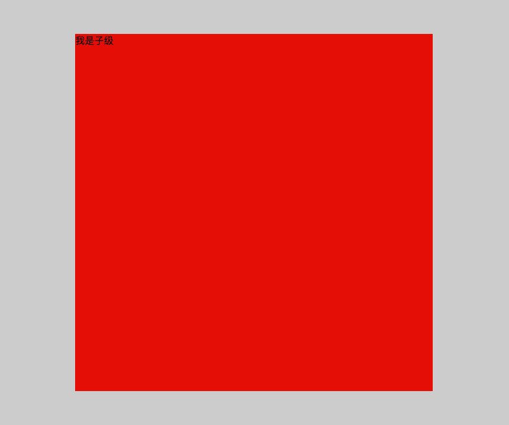
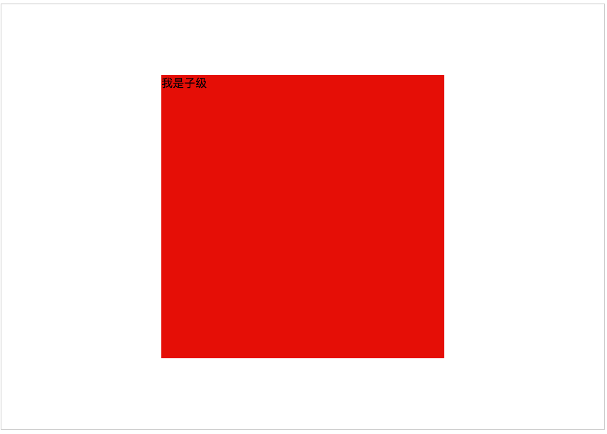
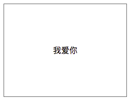
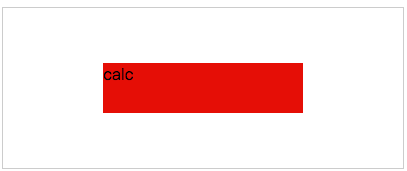

# 前端面试题汇总-css-1

## BFC、IFC、GFC、FFC

CSS2.1中只有BFC和IFC, CSS3中才有GFC和FFC。

到底什么是BFC、IFC、GFC和FFC

### What's FC？

一定不是KFC，FC的全称是：Formatting Contexts，是W3C CSS2.1规范中的一个概念。它是页面中的一块渲染区域，并且有一套渲染规则，它决定了其子元素将如何定位，以及和其他元素的关系和相互作用。

### BFC

BFC(Block Formatting Contexts)直译为"块级格式化上下文"。Block Formatting Contexts就是页面上的一个隔离的渲染区域，容器里面的子元素不会在布局上影响到外面的元素，反之也是如此。如何产生BFC？
float的值不为none。 
overflow的值不为visible。 
position的值不为relative和static。
display的值为table-cell, table-caption, inline-block中的任何一个。 
那BFC一般有什么用呢？比如常见的多栏布局，结合块级别元素浮动，里面的元素则是在一个相对隔离的环境里运行。

### IFC

IFC(Inline Formatting Contexts)直译为"内联格式化上下文"，IFC的line box（线框）高度由其包含行内元素中最高的实际高度计算而来（不受到竖直方向的padding/margin影响)
IFC中的line box一般左右都贴紧整个IFC，但是会因为float元素而扰乱。float元素会位于IFC与与line box之间，使得line box宽度缩短。 同个ifc下的多个line box高度会不同。 IFC中时不可能有块级元素的，当插入块级元素时（如p中插入div）会产生两个匿名块与div分隔开，即产生两个IFC，每个IFC对外表现为块级元素，与div垂直排列。
那么IFC一般有什么用呢？
水平居中：当一个块要在环境中水平居中时，设置其为inline-block则会在外层产生IFC，通过text-align则可以使其水平居中。
垂直居中：创建一个IFC，用其中一个元素撑开父元素的高度，然后设置其vertical-align:middle，其他行内元素则可以在此父元素下垂直居中。

### GFC

GFC(GridLayout Formatting Contexts)直译为"网格布局格式化上下文"，当为一个元素设置display值为grid的时候，此元素将会获得一个独立的渲染区域，我们可以通过在网格容器（grid container）上定义网格定义行（grid definition rows）和网格定义列（grid definition columns）属性各在网格项目（grid item）上定义网格行（grid row）和网格列（grid columns）为每一个网格项目（grid item）定义位置和空间。 
那么GFC有什么用呢，和table又有什么区别呢？首先同样是一个二维的表格，但GridLayout会有更加丰富的属性来控制行列，控制对齐以及更为精细的渲染语义和控制。

### FFC

FFC(Flex Formatting Contexts)直译为"自适应格式化上下文"，display值为flex或者inline-flex的元素将会生成自适应容器（flex container），可惜这个牛逼的属性只有谷歌和火狐支持，不过在移动端也足够了，至少safari和chrome还是OK的，毕竟这俩在移动端才是王道。
Flex Box 由伸缩容器和伸缩项目组成。通过设置元素的 display 属性为 flex 或 inline-flex 可以得到一个伸缩容器。设置为 flex 的容器被渲染为一个块级元素，而设置为 inline-flex 的容器则渲染为一个行内元素。
伸缩容器中的每一个子元素都是一个伸缩项目。伸缩项目可以是任意数量的。伸缩容器外和伸缩项目内的一切元素都不受影响。简单地说，Flexbox 定义了伸缩容器内伸缩项目该如何布局。

# div水平垂直居中的方法

在平时，我们经常会碰到让一个div框针对某个模块上下左右都居中（水平垂直居中），其实针对这种情况，我们有多种方法实现。

**方法一:**

　　绝对定位方法：不确定当前div的宽度和高度，采用 transform: translate(-50%,-50%); 当前div的父级添加相对定位（position: relative;）

　　图片展示：

　　

　　代码如下：

```css
div{
    background:red;
    position: absolute;
    left:50%;
    top:50%;
    transform: translate(-50%, -50%);
}
```

　

**方法二:**

　　绝对定位方法：确定了当前div的宽度，margin值为当前div宽度一半的负值

　　图片展示： 如方法一的图片展示

　　代码如下：

```css
div{
    width:600px;
    height: 600px;
    background:red;
    position: absolute;
    left:50%;
    top:50%;
    margin-left:-300px;
    margin-top:-300px;
}
```

　　

**方法三：**

　　绝对定位方法：绝对定位下top left right bottom 都设置0

　　图片展示： 如方法一的图片展示

　　代码如下：

```css
div.child{
    width: 600px;
    height: 600px;
    background: red;
    position:absolute;
    left:0;
    top: 0;
    bottom: 0;
    right: 0;
    margin: auto;
}
```

　　

**方法四:**

　　flex布局方法：当前div的父级添加flex css样式

   展示图如下：

　　

　　代码如下：

```css
.box{
    height:800px;
    -webkit-display:flex;
    display:flex;
    -webkit-align-items:center;
    align-items:center;
    -webkit-justify-content:center;
    justify-content:center;
    border:1px solid #ccc;
}
div.child{
    width:600px;
    height:600px;
    background-color:red;
}
```

　　

**方法五:**

　　table-cell实现水平垂直居中: table-cell middle center组合使用

   展示图如下：

  


   代码如下：

```css
.table-cell {
    display: table-cell;
    vertical-align: middle;
    text-align: center;
    width: 240px;
    height: 180px;
    border:1px solid #666;
}
```

　　

**方法六:**

　　绝对定位：calc() 函数动态计算实现水平垂直居中

　　展示图如下：



　　代码如下：

```css
.calc{
  position: relative;
  border: 1px solid #ccc;
  width: 400px;
  height: 160px;
}
.calc .child{
  position: absolute;
  width: 200px;
  height: 50px;
  left:-webkit-calc((400px - 200px)/2);
  top:-webkit-calc((160px - 50px)/2);
  left:-moz-calc((400px - 200px)/2);
  top:-moz-calc((160px - 50px)/2);
  left:calc((400px - 200px)/2);
  top:calc((160px - 50px)/2);
}　　
```


## display/opacity

### display: none;

1. DOM 结构：浏览器不会渲染 display 属性为 none 的元素，不占据空间；
2. 事件监听：无法进行 DOM 事件监听；
3. 性能：动态改变此属性时会引起重排，性能较差；
4. 继承：不会被子元素继承，毕竟子类也不会被渲染；
5. transition：transition 不支持 display。

### visibility: hidden;

1. DOM 结构：元素被隐藏，但是会被渲染不会消失，占据空间；
2. 事件监听：无法进行 DOM 事件监听；
3. 性 能：动态改变此属性时会引起重绘，性能较高；
4. 继 承：会被子元素继承，子元素可以通过设置 visibility: visible; 来取消隐藏；
5. transition：visibility 会立即显示，隐藏时会延时

### opacity: 0;

1. DOM 结构：透明度为 100%，元素隐藏，占据空间；
2. 事件监听：可以进行 DOM 事件监听；
3. 性 能：提升为合成层，不会触发重绘，性能较高；
4. 继 承：会被子元素继承,且，子元素并不能通过 opacity: 1 来取消隐藏；
5. transition：opacity 可以延时显示和隐藏


### display: none;

1. DOM 结构：浏览器不会渲染 display 属性为 none 的元素，不占据空间；
2. 事件监听：无法进行 DOM 事件监听；
3. 性能：动态改变此属性时会引起重排，性能较差；
4. 继承：不会被子元素继承，毕竟子类也不会被渲染；
5. transition：transition 不支持 display。

### visibility: hidden;

1. DOM 结构：元素被隐藏，但是会被渲染不会消失，占据空间；
2. 事件监听：无法进行 DOM 事件监听；
3. 性 能：动态改变此属性时会引起重绘，性能较高；
4. 继 承：会被子元素继承，子元素可以通过设置 visibility: visible; 来取消隐藏；
5. transition：visibility 会立即显示，隐藏时会延时

### opacity: 0;

1. DOM 结构：透明度为 100%，元素隐藏，占据空间；
2. 事件监听：可以进行 DOM 事件监听；
3. 性 能：提升为合成层，不会触发重绘，性能较高；
4. 继 承：会被子元素继承,且，子元素并不能通过 opacity: 1 来取消隐藏；
5. transition：opacity 可以延时显示和隐藏


## 内联覆盖元素宽度
### 在不改变当前代码的情况下，使这张图片的宽度为300px?

```html

```


### 1.css方法

```html


```

### 2.js方法

```JavaScript
document.getElementsByTagName("img")[0].setAttribute("style","width:300px!important;")
```
