# 前端面试题汇总-css-2

# 7 种方法解决移动端 Retina 屏幕 1px 边框问题

### 造成边框变粗的原因

其实这个原因很简单，因为css中的1px并不等于移动设备的1px，这些由于不同的手机有不同的像素密度。在window对象中有一个devicePixelRatio属性，他可以反应css中的像素与设备的像素比。

> devicePixelRatio的官方的定义为：设备物理像素和设备独立像素的比例，也就是 devicePixelRatio = 物理像素 / 独立像素。

### 解决边框变粗的6种办法

## 1、0.5px边框

在2014年的 WWDC，“设计响应的Web体验” 一讲中，Ted O’Connor 讲到关于“retinahairlines”（retina 极细的线）：在retina屏上仅仅显示1物理像素的边框，开发者应该如何处理呢。

他们曾介绍到 iOS 8 和 OS X Yosemite 即将支持 0.5px 的边框：


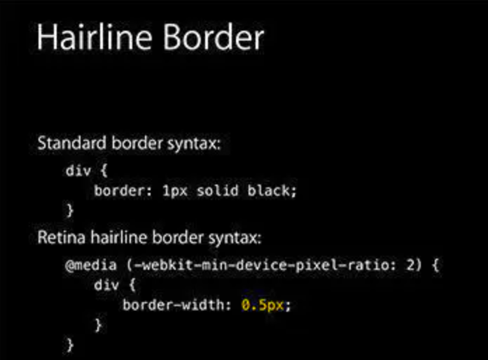

0.5px边框

额的神呐！so easy! 果真如此吗？这样还不够（WWDC幻灯片通常是“唬人”的），但是相差不多。

问题是 retina 屏的浏览器可能不认识0.5px的边框，将会把它解释成0px，没有边框。包括 iOS 7 和之前版本，OS X Mavericks 及以前版本，还有 Android 设备。


**解决方案：**
解决方案是通过 JavaScript 检测浏览器能否处理0.5px的边框，如果可以，给html标签元素添加个class。

```js
if (window.devicePixelRatio && devicePixelRatio >= 2) {
var testElem = document.createElement('div');
testElem.style.border = '.5px solid transparent';
document.body.appendChild(testElem);
if (testElem.offsetHeight == 1) {
document.querySelector('html').classList.add('hairlines');
}
document.body.removeChild(testElem);
}
// 脚本应该放在内，如果在里面运行，需要包装 $(document).ready(function() {})
```

然后，极细的边框样式就容易了：

```css
div {
border: 1px solid #bbb;
}
.hairlines div {
border-width: 0.5px;
}
```


### 2、使用border-image实现

准备一张符合你要求的border-image：

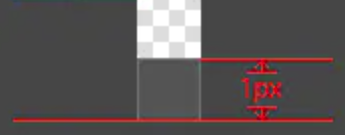

底部边框

样式设置：

```css
.border-bottom-1px {
border-width: 0 0 1px 0;
-webkit-border-image: url(linenew.png) 0 0 2 0 stretch;
border-image: url(linenew.png) 0 0 2 0 stretch;
}
```

上文是把border设置在边框的底部，所以使用的图片是2px高，上部的1px颜色为透明，下部的1px使用视觉规定的border的颜色。如果边框底部和顶部同时需要border，可以使用下面的border-image：

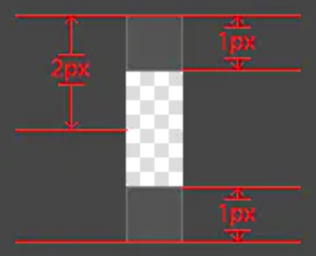

上下边框

样式设置：

```css
.border-image-1px {
border-width: 1px 0;
-webkit-border-image: url(linenew.png) 2 0 stretch;
border-image: url(linenew.png) 2 0 stretch;
}
```

到目前为止，我们已经能在iphone上展现1px border的效果了。但是我们发现这样的方法在非视网膜屏上会出现border显示不出来的现象，于是使用Media Query做了一些兼容，样式设置如下：

```css
.border-image-1px {
border-bottom: 1px solid #666;
}
@media only screen and (-webkit-min-device-pixel-ratio: 2) {
.border-image-1px {
border-bottom: none;
border-width: 0 0 1px 0;
-webkit-border-image: url(../img/linenew.png) 0 0 2 0 stretch;
border-image: url(../img/linenew.png) 0 0 2 0 stretch;
}
}
```

**缺点：**

- 修改颜色麻烦, 需要替换图片
- 圆角需要特殊处理，并且边缘会模糊

### 3、使用background-image实现

background-image 跟border-image的方法一样，你要先准备一张符合你要求的图片。然后将边框模拟在背景上。
样式设置：

```css
.background-image-1px {
background: url(../img/line.png) repeat-x left bottom;
-webkit-background-size: 100% 1px;
background-size: 100% 1px;
}
```

**优点：**

**缺点：**

- 修改颜色麻烦, 需要替换图片
- 圆角需要特殊处理，并且边缘会模糊

### 4、多背景渐变实现

与background-image方案类似，只是将图片替换为css3渐变。设置1px的渐变背景，50%有颜色，50%透明。
样式设置：

```css
.background-gradient-1px {
background:
linear-gradient(180deg, black, black 50%, transparent 50%) top left / 100% 1px no-repeat,
linear-gradient(90deg, black, black 50%, transparent 50%) top right / 1px 100% no-repeat,
linear-gradient(0, black, black 50%, transparent 50%) bottom right / 100% 1px no-repeat,
linear-gradient(-90deg, black, black 50%, transparent 50%) bottom left / 1px 100% no-repeat;
}
/* 或者 */
.background-gradient-1px{
background: -webkit-gradient(linear, left top, left bottom, color-stop(.5, transparent), color-stop(.5, #c8c7cc), to(#c8c7cc)) left bottom repeat-x;
background-size: 100% 1px;
}
```

### 5、使用box-shadow模拟边框

利用css 对阴影处理的方式实现0.5px的效果
样式设置：

```css
.box-shadow-1px {
box-shadow: inset 0px -1px 1px -1px #c8c7cc;
}
```

**优点：**

**缺点：**

### 6、viewport + rem 实现

同时通过设置对应viewport的rem基准值，这种方式就可以像以前一样轻松愉快的写1px了。
在devicePixelRatio = 2 时，输出viewport：


在devicePixelRatio = 3 时，输出viewport：


这种兼容方案相对比较完美，适合新的项目，老的项目修改成本过大。
对于这种方案，可以看看[《使用Flexible实现手淘H5页面的终端适配》](https://github.com/amfe/article/issues/17)
**优点：**

**缺点：**

### 7、伪类 + transform 实现

对于老项目，有没有什么办法能兼容1px的尴尬问题了，个人认为伪类+transform是比较完美的方法了。原理是把原先元素的 border 去掉，然后利用 :before 或者 :after 重做 border ，并 transform 的 scale 缩小一半，原先的元素相对定位，新做的 border 绝对定位。

单条border样式设置：


```css
.scale-1px{
position: relative;
border:none;
}
.scale-1px:after{
content: '';
position: absolute;
bottom: 0;
background: #000;
width: 100%;
height: 1px;
-webkit-transform: scaleY(0.5);
transform: scaleY(0.5);
-webkit-transform-origin: 0 0;
transform-origin: 0 0;
}
```

四条boder样式设置:

```css
.scale-1px{
position: relative;
margin-bottom: 20px;
border:none;
}
.scale-1px:after{
content: '';
position: absolute;
top: 0;
left: 0;
border: 1px solid #000;
-webkit-box-sizing: border-box;
box-sizing: border-box;
width: 200%;
height: 200%;
-webkit-transform: scale(0.5);
transform: scale(0.5);
-webkit-transform-origin: left top;
transform-origin: left top;
}
```

最好在使用前也判断一下，结合 JS 代码，判断是否 Retina 屏：

```js
if(window.devicePixelRatio && devicePixelRatio >= 2){
document.querySelector('ul').className = 'scale-1px';
}
```

**优点：**

- 所有场景都能满足
- 支持圆角(伪类和本体类都需要加border-radius)

**缺点：**

- 对于已经使用伪类的元素(例如clearfix)，可能需要多层嵌套


## 传统布局
圣杯布局和双飞翼布局是前端工程师需要日常掌握的重要布局方式。两者的功能相同，都是为了实现一个**两侧宽度固定，中间宽度自适应的三栏布局**。


圣杯布局与双飞翼布局


圣杯布局来源于文章[In Search of the Holy Grail](https://alistapart.com/article/holygrail)，而双飞翼布局来源于淘宝UED。虽然两者的实现方法略有差异，不过都遵循了以下要点：

- 两侧宽度固定，中间宽度自适应
- 中间部分在DOM结构上优先，以便先行渲染
- 允许三列中的任意一列成为最高列
- 只需要使用一个额外的``标签

下面我将依次介绍圣杯布局和双飞翼布局的实现方法，并在最后根据个人思考对原有方法做出一些修改，给出其它一些可行的方案。

## 圣杯布局

### 1. DOM结构


```xml
<div id="header"></div>
<div id="container">
  <div id="center" class="column"></div>
  <div id="left" class="column"></div>
  <div id="right" class="column"></div>
</div>
<div id="footer"></div>
```

首先定义出整个布局的DOM结构，主体部分是由`container`包裹的`center`,`left`,`right`三列，其中`center`定义在最前面。

### 2. CSS代码

假设左侧的固定宽度为200px，右侧的固定宽度为150px，则首先在`container`上设置：


```css
#container {
  padding-left: 200px; 
  padding-right: 150px;
}
```

为左右两列预留出相应的空间，得到如下示意图：

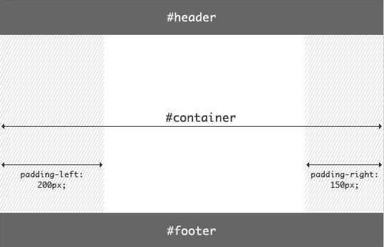

创建布局框架

随后分别为三列设置宽度与浮动，同时对`footer`设置清除浮动：


```css
#container .column {
  float: left;
}

#center {
  width: 100%;
}

#left {
  width: 200px; 
}

#right {
  width: 150px; 
}

#footer {
  clear: both;
}
```

得到如下效果：

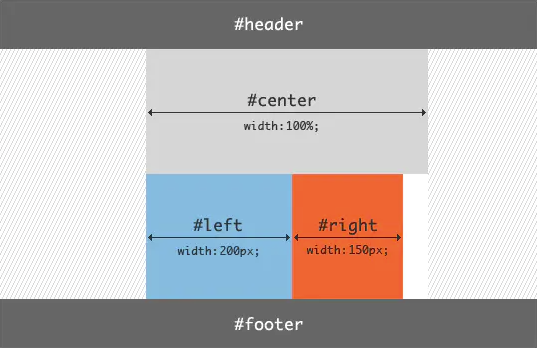

设置宽度和清除浮动

根据浮动的特性，由于`center`的宽度为100%，即占据了第一行的所有空间，所以`left`和`right`被“挤”到了第二行。

接下来的工作是将`left`放置到之前预留出的位置上，这里使用**[负外边距](https://www.cnblogs.com/2050/archive/2012/08/13/2636467.html)（nagetive margin）**：


```css
#left {
  width: 200px; 
  margin-left: -100%;
}
```

得到：

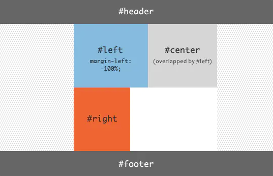

将left移动到预留位置-1

随后还需要使用**定位(position)**方法：


```css
#left {
  width: 200px; 
  margin-left: -100%;
  position: relative;
  right: 200px;
}
```

这里使用`position: relative`和`right: 200px`将`left`的位置在原有位置基础上左移200px，以完成`left`的放置：

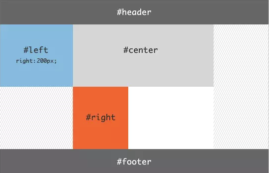

将left移动到预留位置-2

接下来放置`right`，只需添加一条声明即可：


```css
#right {
  width: 150px; 
  margin-right: -150px; 
}
```

得到最终的效果图：

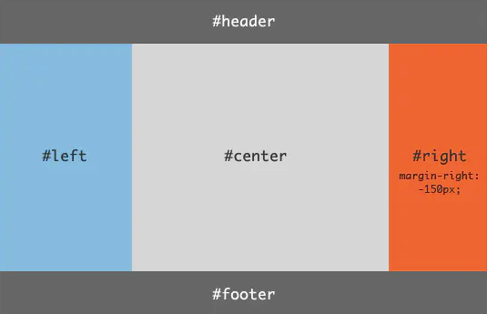

将right移动到预留位置

至此，布局效果完成。不过还需要考虑最后一步，那就是**页面的最小宽度**：要想保证该布局效果正常显示，由于两侧都具有固定的宽度，所以需要给定页面一个最小的宽度，但这并不只是简单的200+150=350px。回想之前`left`使用了`position: relative`，所以就意味着在`center`开始的区域，还存在着一个`left`的宽度。所以页面的最小宽度应该设置为200+150+200=550px：


```css
body {
  min-width: 550px;
}
```

综上所述，圣杯布局的CSS代码为：


```css
body {
  min-width: 550px;
}

#container {
  padding-left: 200px; 
  padding-right: 150px;
}

#container .column {
  float: left;
}

#center {
  width: 100%;
}

#left {
  width: 200px; 
  margin-left: -100%;
  position: relative;
  right: 200px;
}

#right {
  width: 150px; 
  margin-right: -150px; 
}

#footer {
  clear: both;
}
```

关于圣杯布局的示例，可参考：[圣杯布局](https://litaooooo.github.io/page-examples/holy-grail.html)

最后提醒一下很多朋友可能会忽略的小细节：在`#center`中，包含了一条声明`width: 100%`，这是中间栏能够做到自适应的关键。可能会有朋友认为不需要设置这条声明，因为觉得`center`在不设置宽度的情况下会默认将宽度设置为父元素(`container`)的100%宽度。但需要注意到，`center`是浮动元素，由于浮动具有**包裹性**，在不显式设置宽度的情况下会自动“收缩”到内容的尺寸大小。如果去掉`width: 100%`，则当中间栏不包含或者包含较少内容时，整个布局会“崩掉”，而达不到这样的效果：


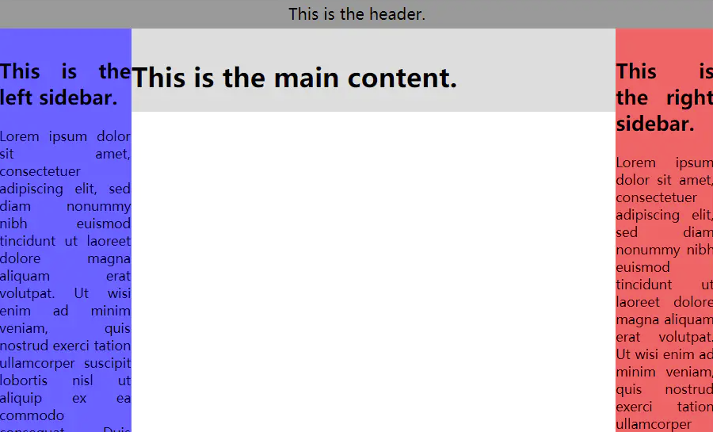

中间栏仅包含较少内容


## 双飞翼布局

### 1. DOM结构


```xml
<body>
  <div id="header"></div>
  <div id="container" class="column">
    <div id="center"></div>
  </div>
  <div id="left" class="column"></div>
  <div id="right" class="column"></div>
  <div id="footer"></div>
<body>
```

双飞翼布局的DOM结构与圣杯布局的区别是用`container`仅包裹住`center`，另外将`.column`类从`center`移至`container`上。

### 2. CSS代码

按照与圣杯布局相同的思路，首先设置各列的宽度与浮动，并且为左右两列预留出空间，以及为`footer`设置浮动清除：


```css
#container {
  width: 100%;
}

.column {
  float: left;
}

#center {
  margin-left: 200px;
  margin-right: 150px;
}

#left {
  width: 200px; 
}

#right {
  width: 150px; 
}

#footer {
  clear: both;
}
```

得到如下效果示意图：

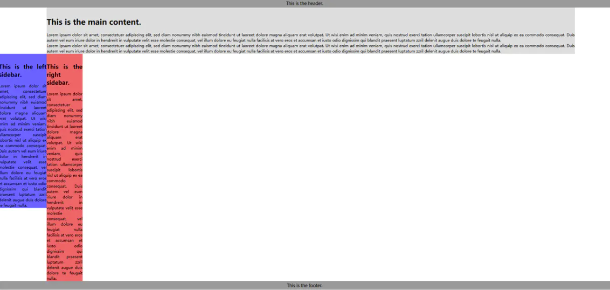

双飞翼布局初始设置

以上代码将`container`,`left`,`right`设置为`float: left`，而在`container`内部，`center`由于没有设置浮动，所以其宽度默认为`container`的100%宽度，通过对其设置`margin-left`和`margin-right`为左右两列预留出了空间。

将`left`放置到预留位置：


```css
#left {
  width: 200px; 
  margin-left: -100%;
}
```

得到：

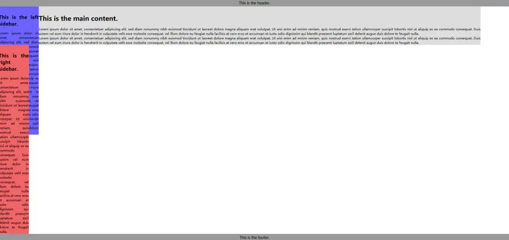

放置left到预留位置

将`right`放置到预留位置：


```css
#right {
  width: 150px; 
  margin-left: -150px;
}
```

得到最终效果：

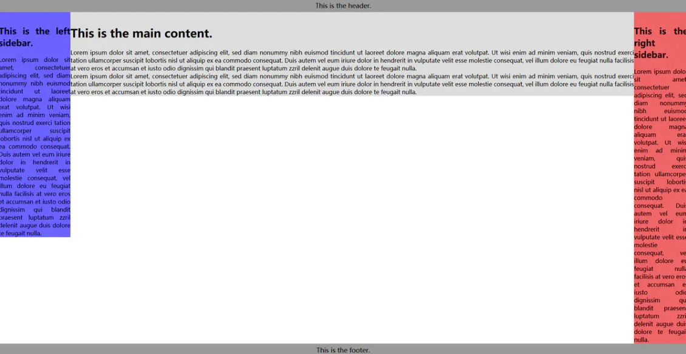

双飞翼布局最终效果

最后计算最小页面宽度：由于双飞翼布局没有用到`position:relative`进行定位，所以最小页面宽度应该为200+150=350px。但是当页面宽度缩小到350px附近时，会挤占中间栏的宽度，使得其内容被右侧栏覆盖，如下所示：


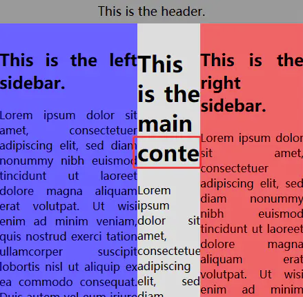

中间栏内容被覆盖


因此在设置最小页面宽度时，应该适当增加一些宽度以供中间栏使用（假设为150px），则有：


```css
body {
  min-width: 500px;
}
```

至此双飞翼布局大功告成！其布局整体代码为：


```css
body {
  min-width: 500px;
}

#container {
  width: 100%;
}

.column {
  float: left;
}
        
#center {
  margin-left: 200px;
  margin-right: 150px;
}
        
#left {
  width: 200px; 
  margin-left: -100%;
}
        
#right {
  width: 150px; 
  margin-left: -150px;
}
        
#footer {
  clear: both;
}
```

关于双飞翼布局的示例，可参考：[双飞翼布局](https://litaooooo.github.io/page-examples/double-wings.html)

## 总结与思考

通过对圣杯布局和双飞翼布局的介绍可以看出，圣杯布局在DOM结构上显得更加直观和自然，且在日常开发过程中，更容易形成这样的DOM结构（通常``和``/``一起被嵌套在``中）；而双飞翼布局在实现上由于不需要使用定位，所以更加简洁，且允许的页面最小宽度通常比圣杯布局更小。

其实通过思考不难发现，两者在代码实现上都额外引入了一个``标签，其目的都是为了既能保证中间栏产生浮动（浮动后还**必须**显式设置宽度），又能限制自身宽度为两侧栏留出空间。

从这个角度出发，如果去掉额外添加的``标签，能否完成相同的布局呢？答案是肯定的，不过这需要在**兼容性上做出牺牲**：

### DOM结构


```xml
<div id="header"></div>
<div id="center" class="column"></div>
<div id="left" class="column"></div>
<div id="right" class="column"></div>
<div id="footer"></div>
```

去掉额外的``标签后，得到的DOM结构如上所示，基于双飞翼布局的实现思路，只需要在`center`上做出修改：

### 1. 使用calc()


```css
.column {
  float: left;
}
    
#center {
  margin-left: 200px;
  margin-right: 150px;
  width: calc(100% - 350px);
}
```

通过`calc()`可以十分方便地计算出`center`应该占据的自适应宽度，目前`calc()`支持到**IE9**。

### 2. 使用border-box


```css
.column {
  float: left;
}
    
#center {
  padding-left: 200px;
  padding-right: 150px;
  box-sizing: border-box;
  width: 100%;
}
```

使用`border-box`可以将`center`的整个盒模型宽度设置为父元素的100%宽度，此时再利用`padding-left`和`padding-right`可以自动得到中间栏的自适应宽度。不过需要注意的是，由于padding是盒子的一部分，所以padding部分会具有中间栏的背景色，当中间栏高于侧栏时，会出现这样的情况：


padding背景色影响左侧空间

目前`box-sizing`支持到**IE8**。

### 3.  使用flex

这里使用flex还是需要与圣杯布局相同的DOM结构，不过在实现上将更加简单：


```xml
<!-- DOM结构 -->
<div id="container">
  <div id="center"></div>
  <div id="left"></div>
  <div id="right"></div>
</div>
```

CSS代码如下：


```css
#container {
    display: flex;
}

#center {
    flex: 1;
}

#left {
    flex: 0 0 200px;
    order: -1;
}

#right {
    flex: 0 0 150px;
}
```
