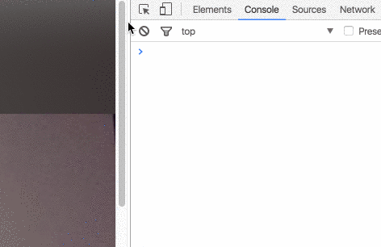
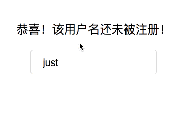
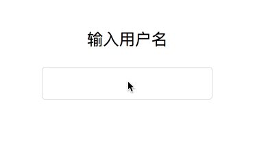
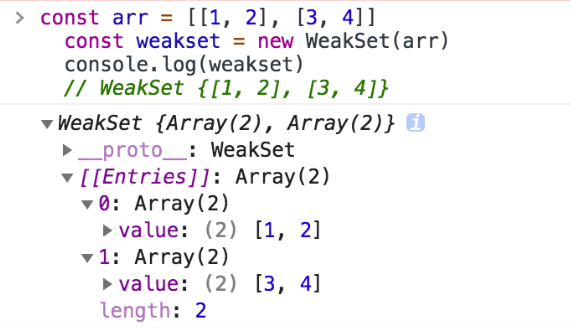

# 前端面试题汇总-js-1

## ['1', '2', '3'].map(parseInt) 

what & why ?

早在 2013年, 有人在微博上发布了以下代码段:

```js
['10','10','10','10','10'].map(parseInt);
// [10, NaN, 2, 3, 4]
```

### parseInt

`parseInt()` 函数解析一个字符串参数，并返回一个指定基数的整数 (数学系统的基础)。

```js
const intValue = parseInt(string[, radix]);
```

`string` 要被解析的值。如果参数不是一个字符串，则将其转换为字符串(使用 ToString 抽象操作)。字符串开头的空白符将会被忽略。

`radix` 一个介于2和36之间的整数(数学系统的基础)，表示上述字符串的基数。默认为10。 `返回值` 返回一个整数或NaN

```js
parseInt(100); // 100
parseInt(100, 10); // 100
parseInt(100, 2); // 4 -> converts 100 in base 2 to base 10
```

**注意：** 在`radix`为 undefined，或者`radix`为 0 或者没有指定的情况下，JavaScript 作如下处理：

- 如果字符串 string 以"0x"或者"0X"开头, 则基数是16 (16进制).
- 如果字符串 string 以"0"开头, 基数是8（八进制）或者10（十进制），那么具体是哪个基数由实现环境决定。ECMAScript 5 规定使用10，但是并不是所有的浏览器都遵循这个规定。因此，永远都要明确给出radix参数的值。
- 如果字符串 string 以其它任何值开头，则基数是10 (十进制)。

更多详见[parseInt | MDN](https://developer.mozilla.org/zh-CN/docs/Web/JavaScript/Reference/Global_Objects/parseInt)

### map

`map()` 方法创建一个新数组，其结果是该数组中的每个元素都调用一个提供的函数后返回的结果。

```js
var new_array = arr.map(function callback(currentValue[,index[, array]]) {
 // Return element for new_array
 }[, thisArg])
```

可以看到`callback`回调函数需要三个参数, 我们通常只使用第一个参数 (其他两个参数是可选的)。 `currentValue` 是callback 数组中正在处理的当前元素。 `index`可选, 是callback 数组中正在处理的当前元素的索引。 `array`可选, 是callback map 方法被调用的数组。 另外还有`thisArg`可选, 执行 callback 函数时使用的this 值。

```js
const arr = [1, 2, 3];
arr.map((num) => num + 1); // [2, 3, 4]
```

更多详见[Array.prototype.map() | MDN](https://developer.mozilla.org/zh-CN/docs/Web/JavaScript/Reference/Global_Objects/Array/map)

### 回到真实的事例上

回到我们真实的事例上

```js
['1', '2', '3'].map(parseInt)
```

对于每个迭代`map`, `parseInt()`传递两个参数: **字符串和基数**。 所以实际执行的的代码是：

```js
['1', '2', '3'].map((item, index) => {
	return parseInt(item, index)
})
```

即返回的值分别为：

```js
parseInt('1', 0) // 1
parseInt('2', 1) // NaN
parseInt('3', 2) // NaN, 3 不是二进制
```

所以：

```js
['1', '2', '3'].map(parseInt)
// 1, NaN, NaN
```

由此，加里·伯恩哈德例子也就很好解释了，这里不再赘述

```js
['10','10','10','10','10'].map(parseInt);
// [10, NaN, 2, 3, 4]
```

### 如何在现实世界中做到这一点

如果您实际上想要循环访问字符串数组, 该怎么办？ `map()`然后把它换成数字？使用编号!

```js
['10','10','10','10','10'].map(Number);
// [10, 10, 10, 10, 10]
```


## 函数节流与函数防抖

### 什么是函数节流与函数防抖

举个栗子，我们知道目前的一种说法是当 1 秒内连续播放 24 张以上的图片时，在人眼的视觉中就会形成一个连贯的动画，所以在电影的播放（以前是，现在不知道）中基本是以每秒 24 张的速度播放的，为什么不 100 张或更多是因为 24 张就可以满足人类视觉需求的时候，100 张就会显得很浪费资源。

再举个栗子，假设电梯一次只能载一人的话，10 个人要上楼的话电梯就得走 10 次，是一种浪费资源的行为；而实际生活正显然不是这样的，当电梯里有人准备上楼的时候如果外面又有人按电梯的话，电梯会再次打开直到满载位置，从电梯的角度来说，这时一种节约资源的行为（相对于一次只能载一个人）。

- 函数节流: 指定时间间隔内只会执行一次任务；
- 函数防抖: 任务频繁触发的情况下，只有任务触发的间隔超过指定间隔的时候，任务才会执行。

### 函数节流(throttle)

这里以判断页面是否滚动到底部为例，普通的做法就是监听 `window` 对象的 `scroll` 事件，然后再函数体中写入判断是否滚动到底部的逻辑：

```js
$(window).on('scroll', function () {
    // 判断是否滚动到底部的逻辑
    let pageHeight = $('body').height(),
        scrollTop = $(window).scrollTop(),
        winHeight = $(window).height(),
        thresold = pageHeight - scrollTop - winHeight;
    if (thresold > -100 && thresold <= 20) {
        console.log('end');
    }
});
```



这样做的一个缺点就是比较消耗性能，因为当在滚动的时候，浏览器会无时不刻地在计算判断是否滚动到底部的逻辑，而在实际的场景中是不需要这么做的，在实际场景中可能是这样的：在滚动过程中，每隔一段时间在去计算这个判断逻辑。而函数节流所做的工作就是每隔一段时间去执行一次原本需要无时不刻地在执行的函数，所以在滚动事件中引入函数的节流是一个非常好的实践：

```js
$(window).on('scroll', throttle(function () {
    // 判断是否滚动到底部的逻辑
    let pageHeight = $('body').height(),
        scrollTop = $(window).scrollTop(),
        winHeight = $(window).height(),
        thresold = pageHeight - scrollTop - winHeight;
    if (thresold > -100 && thresold <= 20) {
        console.log('end');
    }
}));
```


加上函数节流之后，当页面再滚动的时候，每隔 `300ms` 才会去执行一次判断逻辑。

简单来说，函数的节流就是通过闭包保存一个标记（`canRun = true`），在函数的开头**判断**这个标记是否为 `true`，如果为 `true` 的话就继续执行函数，否则则 return 掉，判断完标记后立即把这个标记设为 `false`，然后把外部传入的函数的执行包在一个 `setTimeout` 中，最后在 `setTimeout` 执行完毕后再把标记设置为 `true`（这里很关键），表示可以执行下一次的循环了。当 `setTimeout` 还未执行的时候，`canRun` 这个标记始终为 `false`，在开头的判断中被 return 掉。

```js
function throttle(fn, interval = 300) {
    let canRun = true;
    return function () {
        if (!canRun) return;
        canRun = false;
        setTimeout(() => {
            fn.apply(this, arguments);
            canRun = true;
        }, interval);
    };
}
```

###  函数防抖(debounce)

这里以用户注册时验证用户名是否被占用为例，如今很多网站为了提高用户体验，不会再输入框失去焦点的时候再去判断用户名是否被占用，而是在输入的时候就在判断这个用户名是否已被注册：

```js
$('input.user-name').on('input', function () {
    $.ajax({
        url: `https://just.com/check`,
        method: 'post',
        data: {
            username: $(this).val(),
        },
        success(data) {
            if (data.isRegistered) {
                $('.tips').text('该用户名已被注册！');
            } else {
                $('.tips').text('恭喜！该用户名还未被注册！');
            }
        },
        error(error) {
            console.log(error);
        },
    });
});
```



很明显，这样的做法不好的是当用户输入第一个字符的时候，就开始请求判断了，不仅对服务器的压力增大了，对用户体验也未必比原来的好。而理想的做法应该是这样的，当用户输入第一个字符后的一段时间内如果还有字符输入的话，那就暂时不去请求判断用户名是否被占用。在这里引入函数防抖就能很好地解决这个问题：

```js
$('input.user-name').on('input', debounce(function () {
    $.ajax({
        url: `https://just.com/check`,
        method: 'post',
        data: {
            username: $(this).val(),
        },
        success(data) {
            if (data.isRegistered) {
                $('.tips').text('该用户名已被注册！');
            } else {
                $('.tips').text('恭喜！该用户名还未被注册！');
            }
        },
        error(error) {
            console.log(error);
        },
    });
}));
```



其实函数防抖的原理也非常地简单，通过闭包保存一个标记来保存 `setTimeout` 返回的值，每当用户输入的时候把前一个 `setTimeout` clear 掉，然后又创建一个新的 `setTimeout`，这样就能保证输入字符后的 `interval` 间隔内如果还有字符输入的话，就不会执行 `fn` 函数了。

```js
function debounce(fn, interval = 300) {
    let timeout = null;
    return function () {
        clearTimeout(timeout);
        timeout = setTimeout(() => {
            fn.apply(this, arguments);
        }, interval);
    };
}
```

### 总结

其实函数节流与函数防抖的原理非常简单，巧妙地使用 `setTimeout` 来存放待执行的函数，这样可以很方便的利用 `clearTimeout` 在合适的时机来清除待执行的函数。

使用函数节流与函数防抖的目的，在开头的栗子中应该也能看得出来，就是为了节约计算机资源。

## Set 和 Map 
Set 和 Map 主要的应用场景在于 **数据重组** 和 **数据储存**

Set 是一种叫做**集合**的数据结构，Map 是一种叫做**字典**的数据结构

### 1. 集合（Set）

ES6 新增的一种新的数据结构，类似于数组，但成员是唯一且无序的，没有重复的值。

**Set 本身是一种构造函数，用来生成 Set 数据结构。**

```js
new Set([iterable])
```

举个例子：

```js
const s = new Set()
[1, 2, 3, 4, 3, 2, 1].forEach(x => s.add(x))

for (let i of s) {
    console.log(i)	// 1 2 3 4
}

// 去重数组的重复对象
let arr = [1, 2, 3, 2, 1, 1]
[... new Set(arr)]	// [1, 2, 3]
```

Set 对象允许你储存任何类型的唯一值，无论是原始值或者是对象引用。

向 Set 加入值的时候，不会发生类型转换，所以`5`和`"5"`是两个不同的值。Set 内部判断两个值是否不同，使用的算法叫做“Same-value-zero equality”，它类似于**精确相等**运算符（`===`），主要的区别是**`NaN`等于自身，而精确相等运算符认为`NaN`不等于自身。**

```js
let set = new Set();
let a = NaN;
let b = NaN;
set.add(a);
set.add(b);
set // Set {NaN}

let set1 = new Set()
set1.add(5)
set1.add('5')
console.log([...set1])	// [5, "5"]
```

- Set 实例属性

  - constructor： 构造函数

  - size：元素数量

    ```js
    let set = new Set([1, 2, 3, 2, 1])
    
    console.log(set.length)	// undefined
    console.log(set.size)	// 3
    ```

- Set 实例方法

  - 操作方法

    - add(value)：新增，相当于 array里的push

    - delete(value)：存在即删除集合中value

    - has(value)：判断集合中是否存在 value

    - clear()：清空集合

      ------

      ```js
      let set = new Set()
      set.add(1).add(2).add(1)
      
      set.has(1)	// true
      set.has(3)	// false
      set.delete(1)	
      set.has(1)	// false
      ```

      `Array.from` 方法可以将 Set 结构转为数组

      ```js
      const items = new Set([1, 2, 3, 2])
      const array = Array.from(items)
      console.log(array)	// [1, 2, 3]
      // 或
      const arr = [...items]
      console.log(arr)	// [1, 2, 3]
      ```

  - 遍历方法（遍历顺序为插入顺序）

    - keys()：返回一个包含集合中所有键的迭代器

    - values()：返回一个包含集合中所有值得迭代器

    - entries()：返回一个包含Set对象中所有元素得键值对迭代器

    - forEach(callbackFn, thisArg)：用于对集合成员执行callbackFn操作，如果提供了 thisArg 参数，回调中的this会是这个参数，**没有返回值**

      ```js
      let set = new Set([1, 2, 3])
      console.log(set.keys())	// SetIterator {1, 2, 3}
      console.log(set.values())	// SetIterator {1, 2, 3}
      console.log(set.entries())	// SetIterator {1, 2, 3}
      
      for (let item of set.keys()) {
        console.log(item);
      }	// 1	2	 3
      for (let item of set.entries()) {
        console.log(item);
      }	// [1, 1]	[2, 2]	[3, 3]
      
      set.forEach((value, key) => {
          console.log(key + ' : ' + value)
      })	// 1 : 1	2 : 2	3 : 3
      console.log([...set])	// [1, 2, 3]
      ```

      Set 可默认遍历，默认迭代器生成函数是 values() 方法

      ```js
      Set.prototype[Symbol.iterator] === Set.prototype.values	// true
      ```

      所以， Set可以使用 map、filter 方法

      ```js
      let set = new Set([1, 2, 3])
      set = new Set([...set].map(item => item * 2))
      console.log([...set])	// [2, 4, 6]
      
      set = new Set([...set].filter(item => (item >= 4)))
      console.log([...set])	//[4, 6]
      ```

      因此，Set 很容易实现交集（Intersect）、并集（Union）、差集（Difference）

      ```js
      let set1 = new Set([1, 2, 3])
      let set2 = new Set([4, 3, 2])
      
      let intersect = new Set([...set1].filter(value => set2.has(value)))
      let union = new Set([...set1, ...set2])
      let difference = new Set([...set1].filter(value => !set2.has(value)))
      
      console.log(intersect)	// Set {2, 3}
      console.log(union)		// Set {1, 2, 3, 4}
      console.log(difference)	// Set {1}
      ```

### 2. WeakSet

WeakSet 对象允许你将**弱引用对象**储存在一个集合中

WeakSet 与 Set 的区别：

- WeakSet 只能储存对象引用，不能存放值，而 Set 对象都可以
- WeakSet 对象中储存的对象值都是被弱引用的，即垃圾回收机制不考虑 WeakSet 对该对象的应用，如果没有其他的变量或属性引用这个对象值，则这个对象将会被垃圾回收掉（不考虑该对象还存在于 WeakSet 中），所以，WeakSet 对象里有多少个成员元素，取决于垃圾回收机制有没有运行，运行前后成员个数可能不一致，遍历结束之后，有的成员可能取不到了（被垃圾回收了），WeakSet 对象是无法被遍历的（ES6 规定 WeakSet 不可遍历），也没有办法拿到它包含的所有元素

属性：

- constructor：构造函数，任何一个具有 Iterable 接口的对象，都可以作参数

  ```js
  const arr = [[1, 2], [3, 4]]
  const weakset = new WeakSet(arr)
  console.log(weakset)
  ```



方法：

- add(value)：在WeakSet 对象中添加一个元素value
- has(value)：判断 WeakSet 对象中是否包含value
- delete(value)：删除元素 value
- clear()：清空所有元素，**注意该方法已废弃**

```js
var ws = new WeakSet()
var obj = {}
var foo = {}

ws.add(window)
ws.add(obj)

ws.has(window)	// true
ws.has(foo)	// false

ws.delete(window)	// true
ws.has(window)	// false
```

### 3. 字典（Map）

集合 与 字典 的区别：

- 共同点：集合、字典 可以储存不重复的值
- 不同点：集合 是以 [value, value]的形式储存元素，字典 是以 [key, value] 的形式储存

```js
const m = new Map()
const o = {p: 'haha'}
m.set(o, 'content')
m.get(o)	// content

m.has(o)	// true
m.delete(o)	// true
m.has(o)	// false
```

**任何具有 Iterator 接口、且每个成员都是一个双元素的数组的数据结构**都可以当作`Map`构造函数的参数，例如：

```js
const set = new Set([
  ['foo', 1],
  ['bar', 2]
]);
const m1 = new Map(set);
m1.get('foo') // 1

const m2 = new Map([['baz', 3]]);
const m3 = new Map(m2);
m3.get('baz') // 3
```

如果读取一个未知的键，则返回`undefined`。

```js
new Map().get('asfddfsasadf')
// undefined
```

注意，只有对同一个对象的引用，Map 结构才将其视为同一个键。这一点要非常小心。

```js
const map = new Map();

map.set(['a'], 555);
map.get(['a']) // undefined
```

上面代码的`set`和`get`方法，表面是针对同一个键，但实际上这是两个值，内存地址是不一样的，因此`get`方法无法读取该键，返回`undefined`。

由上可知，Map 的键实际上是跟内存地址绑定的，只要内存地址不一样，就视为两个键。这就解决了同名属性碰撞（clash）的问题，我们扩展别人的库的时候，如果使用对象作为键名，就不用担心自己的属性与原作者的属性同名。

如果 Map 的键是一个简单类型的值（数字、字符串、布尔值），则只要两个值严格相等，Map 将其视为一个键，比如`0`和`-0`就是一个键，布尔值`true`和字符串`true`则是两个不同的键。另外，`undefined`和`null`也是两个不同的键。虽然`NaN`不严格相等于自身，但 Map 将其视为同一个键。

```js
let map = new Map();

map.set(-0, 123);
map.get(+0) // 123

map.set(true, 1);
map.set('true', 2);
map.get(true) // 1

map.set(undefined, 3);
map.set(null, 4);
map.get(undefined) // 3

map.set(NaN, 123);
map.get(NaN) // 123
```

Map 的属性及方法

属性：

- constructor：构造函数

- size：返回字典中所包含的元素个数

  ```js
  const map = new Map([
    ['name', 'An'],
    ['des', 'JS']
  ]);
  
  map.size // 2
  ```

操作方法：

- set(key, value)：向字典中添加新元素
- get(key)：通过键查找特定的数值并返回
- has(key)：判断字典中是否存在键key
- delete(key)：通过键 key 从字典中移除对应的数据
- clear()：将这个字典中的所有元素删除

遍历方法

- Keys()：将字典中包含的所有键名以迭代器形式返回
- values()：将字典中包含的所有数值以迭代器形式返回
- entries()：返回所有成员的迭代器
- forEach()：遍历字典的所有成员

```js
const map = new Map([
            ['name', 'An'],
            ['des', 'JS']
        ]);
console.log(map.entries())	// MapIterator {"name" => "An", "des" => "JS"}
console.log(map.keys()) // MapIterator {"name", "des"}
```

Map 结构的默认遍历器接口（`Symbol.iterator`属性），就是`entries`方法。

```js
map[Symbol.iterator] === map.entries
// true
```

Map 结构转为数组结构，比较快速的方法是使用扩展运算符（`...`）。

对于 forEach ，看一个例子

```js
const reporter = {
  report: function(key, value) {
    console.log("Key: %s, Value: %s", key, value);
  }
};

let map = new Map([
    ['name', 'An'],
    ['des', 'JS']
])
map.forEach(function(value, key, map) {
  this.report(key, value);
}, reporter);
// Key: name, Value: An
// Key: des, Value: JS
```

在这个例子中， forEach 方法的回调函数的 this，就指向 reporter

**与其他数据结构的相互转换**

1. Map 转 Array

   ```js
   const map = new Map([[1, 1], [2, 2], [3, 3]])
   console.log([...map])	// [[1, 1], [2, 2], [3, 3]]
   ```

2. Array 转 Map

   ```js
   const map = new Map([[1, 1], [2, 2], [3, 3]])
   console.log(map)	// Map {1 => 1, 2 => 2, 3 => 3}
   ```

3. Map 转 Object

   因为 Object 的键名都为字符串，而Map 的键名为对象，所以转换的时候会把非字符串键名转换为字符串键名。

   ```js
   function mapToObj(map) {
       let obj = Object.create(null)
       for (let [key, value] of map) {
           obj[key] = value
       }
       return obj
   }
   const map = new Map().set('name', 'An').set('des', 'JS')
   mapToObj(map)  // {name: "An", des: "JS"}
   ```

4. Object 转 Map

   ```js
   function objToMap(obj) {
       let map = new Map()
       for (let key of Object.keys(obj)) {
           map.set(key, obj[key])
       }
       return map
   }
   
   objToMap({'name': 'An', 'des': 'JS'}) // Map {"name" => "An", "des" => "JS"}
   ```

5. Map 转 JSON

   ```js
   function mapToJson(map) {
       return JSON.stringify([...map])
   }
   
   let map = new Map().set('name', 'An').set('des', 'JS')
   mapToJson(map)	// [["name","An"],["des","JS"]]
   ```

6. JSON 转 Map

   ```js
   function jsonToStrMap(jsonStr) {
     return objToMap(JSON.parse(jsonStr));
   }
   
   jsonToStrMap('{"name": "An", "des": "JS"}') // Map {"name" => "An", "des" => "JS"}
   ```

### 4. WeakMap

WeakMap 对象是一组键值对的集合，其中的**键是弱引用对象，而值可以是任意**。

**注意，WeakMap 弱引用的只是键名，而不是键值。键值依然是正常引用。**

WeakMap 中，每个键对自己所引用对象的引用都是弱引用，在没有其他引用和该键引用同一对象，这个对象将会被垃圾回收（相应的key则变成无效的），所以，WeakMap 的 key 是不可枚举的。

属性：

- constructor：构造函数

方法：

- has(key)：判断是否有 key 关联对象
- get(key)：返回key关联对象（没有则则返回 undefined）
- set(key)：设置一组key关联对象
- delete(key)：移除 key 的关联对象

```js
let myElement = document.getElementById('logo');
let myWeakmap = new WeakMap();

myWeakmap.set(myElement, {timesClicked: 0});

myElement.addEventListener('click', function() {
  let logoData = myWeakmap.get(myElement);
  logoData.timesClicked++;
}, false);
```

## 介绍下Set_Map_WeakSet和WeakMap的区别

### 5. 总结

- Set
  - 成员唯一、无序且不重复
  - [value, value]，键值与键名是一致的（或者说只有键值，没有键名）
  - 可以遍历，方法有：add、delete、has
- WeakSet
  - 成员都是对象
  - 成员都是弱引用，可以被垃圾回收机制回收，可以用来保存DOM节点，不容易造成内存泄漏
  - 不能遍历，方法有add、delete、has
- Map
  - 本质上是键值对的集合，类似集合
  - 可以遍历，方法很多可以跟各种数据格式转换
- WeakMap
  - 只接受对象作为键名（null除外），不接受其他类型的值作为键名
  - 键名是弱引用，键值可以是任意的，键名所指向的对象可以被垃圾回收，此时键名是无效的
  - 不能遍历，方法有get、set、has、delete

### 6. 扩展：Object与Set、Map

1. Object 与 Set

   ```js
   // Object
   const properties1 = {
       'width': 1,
       'height': 1
   }
   console.log(properties1['width']? true: false) // true
   
   // Set
   const properties2 = new Set()
   properties2.add('width')
   properties2.add('height')
   console.log(properties2.has('width')) // true
   ```

2. Object 与 Map

### ES6 WeakMap和WeakSet的使用场景

JS 中的对象（Object），本质上是键值对的集合（hash 结构）

```js
const data = {};
const element = document.getElementsByClassName('App');

data[element] = 'metadata';
console.log(data['[object HTMLCollection]']) // "metadata"
```

但当以一个DOM节点作为对象 data 的键，对象会被自动转化为字符串[Object HTMLCollection]，所以说，Object 结构提供了 **字符串-值** 对应，Map则提供了 **值-值** 的对应

本

JavaScript垃圾回收是一种内存管理技术。在这种技术中，不再被引用的对象会被自动删除，而与其相关的资源也会被一同回收。

Map和Set中对象的引用都是强类型化的，并不会允许垃圾回收。这样一来，如果Map和Set中引用了不再需要的大型对象，如已经从DOM树中删除的DOM元素，那么其回收代价是昂贵的。

为了解决这个问题，ES6还引入了另外两种新的数据结构，即称为WeakMap和WeakSet的弱集合。这些集合之所以是“**弱的**”，是因为它们允许从内存中清除不再需要的被这些集合所引用的对象。

 

使用场景：**储存 DOM 节点，而不用担心这些节点从文档移除时，会引发内存泄漏**。
