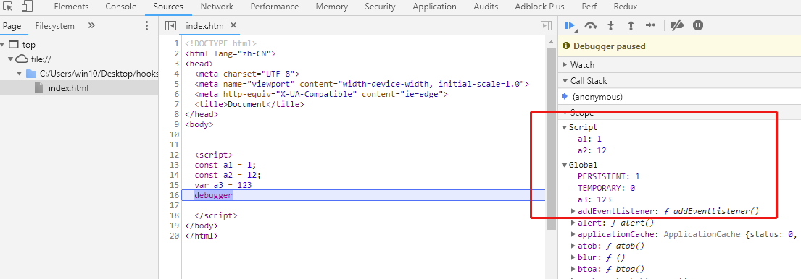
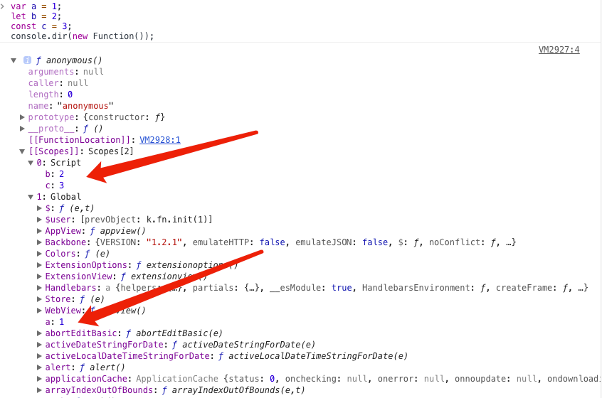

# 前端面试题汇总-js-2

## 有以下 3 个判断数组的方法，请分别介绍它们之间的区别和优劣

### 1. Object.prototype.toString.call()

每一个继承 Object 的对象都有 `toString` 方法，如果 `toString` 方法没有重写的话，会返回 `[Object type]`，其中 type 为对象的类型。但当除了 Object 类型的对象外，其他类型直接使用 `toString` 方法时，会直接返回都是内容的字符串，所以我们需要使用call或者apply方法来改变toString方法的执行上下文。

```js
const an = ['Hello','An'];
an.toString(); // "Hello,An"
Object.prototype.toString.call(an); // "[object Array]"
```

这种方法对于所有基本的数据类型都能进行判断，即使是 null 和 undefined 。

```js
Object.prototype.toString.call('An') // "[object String]"
Object.prototype.toString.call(1) // "[object Number]"
Object.prototype.toString.call(Symbol(1)) // "[object Symbol]"
Object.prototype.toString.call(null) // "[object Null]"
Object.prototype.toString.call(undefined) // "[object Undefined]"
Object.prototype.toString.call(function(){}) // "[object Function]"
Object.prototype.toString.call({name: 'An'}) // "[object Object]"
```

`Object.prototype.toString.call()` 常用于判断浏览器内置对象时。

更多实现可见 [谈谈 Object.prototype.toString](https://juejin.im/post/591647550ce4630069df1c4a)

### 2. instanceof

`instanceof` 的内部机制是通过判断对象的原型链中是不是能找到类型的 `prototype`。

使用 `instanceof`判断一个对象是否为数组，`instanceof` 会判断这个对象的原型链上是否会找到对应的 `Array` 的原型，找到返回 `true`，否则返回 `false`。

```js
[]  instanceof Array; // true
```

但 `instanceof` 只能用来判断对象类型，原始类型不可以。并且所有对象类型 instanceof Object 都是 true。

```js
[]  instanceof Object; // true
```

### 3. Array.isArray()

- 功能：用来判断对象是否为数组

- `Array.isArray()` 与 `Object.prototype.toString.call()`

  `Array.isArray()`是ES5新增的方法，当不存在 `Array.isArray()` ，可以用 `Object.prototype.toString.call()` 实现。

  ```js
  if (!Array.isArray) {
    Array.isArray = function(arg) {
      return Object.prototype.toString.call(arg) === '[object Array]';
    };
  }
  ```


## ES5/ES6 的定义对象的区别

1. `class` 声明会提升，但不会初始化赋值。`Foo` 进入暂时性死区，类似于 `let`、`const` 声明变量。

```javascript

const bar = new Bar(); // it's ok
function Bar() {
  this.bar = 42;
}

const foo = new Foo(); // ReferenceError: Foo is not defined
class Foo {
  constructor() {
    this.foo = 42;
  }
}
```

1. `class` 声明内部会启用严格模式。

```javascript
// 引用一个未声明的变量
function Bar() {
  baz = 42; // it's ok
}
const bar = new Bar();

class Foo {
  constructor() {
    fol = 42; // ReferenceError: fol is not defined
  }
}
const foo = new Foo();
```

### class` 的所有方法（包括静态方法和实例方法）都是不可枚举的。

```javascript
// 引用一个未声明的变量
function Bar() {
  this.bar = 42;
}
Bar.answer = function() {
  return 42;
};
Bar.prototype.print = function() {
  console.log(this.bar);
};
const barKeys = Object.keys(Bar); // ['answer']
const barProtoKeys = Object.keys(Bar.prototype); // ['print']

class Foo {
  constructor() {
    this.foo = 42;
  }
  static answer() {
    return 42;
  }
  print() {
    console.log(this.foo);
  }
}
const fooKeys = Object.keys(Foo); // []
const fooProtoKeys = Object.keys(Foo.prototype); // []
```

1. `class` 的所有方法（包括静态方法和实例方法）都没有原型对象 prototype，所以也没有`[[construct]]`，不能使用 `new` 来调用。

```javascript
function Bar() {
  this.bar = 42;
}
Bar.prototype.print = function() {
  console.log(this.bar);
};

const bar = new Bar();
const barPrint = new bar.print(); // it's ok

class Foo {
  constructor() {
    this.foo = 42;
  }
  print() {
    console.log(this.foo);
  }
}
const foo = new Foo();
const fooPrint = new foo.print(); // TypeError: foo.print is not a constructor
```

1. 必须使用 `new` 调用 `class`。

```javascript
function Bar() {
  this.bar = 42;
}
const bar = Bar(); // it's ok

class Foo {
  constructor() {
    this.foo = 42;
  }
}
const foo = Foo(); // TypeError: Class constructor Foo cannot be invoked without 'new'
```

1. `class` 内部无法重写类名。

```javascript
function Bar() {
  Bar = 'Baz'; // it's ok
  this.bar = 42;
}
const bar = new Bar();
// Bar: 'Baz'
// bar: Bar {bar: 42}  

class Foo {
  constructor() {
    this.foo = 42;
    Foo = 'Fol'; // TypeError: Assignment to constant variable
  }
}
const foo = new Foo();
Foo = 'Fol'; // it's ok
```

## 全局作用域中，用 const 和 let 声明的变量不在 window 上，那到底在哪里？如何去获取？

在ES5中，顶层对象的属性和全局变量是等价的，var 命令和 function 命令声明的全局变量，自然也是顶层对象。

```js
var a = 12;
function f(){};

console.log(window.a); // 12
console.log(window.f); // f(){}
```

但ES6规定，var 命令和 function 命令声明的全局变量，依旧是顶层对象的属性，但 let命令、const命令、class命令声明的全局变量，不属于顶层对象的属性。

```js
let aa = 1;
const bb = 2;

console.log(window.aa); // undefined
console.log(window.bb); // undefined
```

在哪里？怎么获取？通过在设置断点，看看浏览器是怎么处理的：



通过上图也可以看到，在全局作用域中，用 let 和 const 声明的全局变量并没有在全局对象中，只是一个块级作用域（Script）中

怎么获取？在定义变量的块级作用域中就能获取啊，既然不属于顶层对象，那就不加 window（global）呗。

```js
let aa = 1;
const bb = 2;

console.log(aa); // 1
console.log(bb); // 2
```




const和let会生成块级作用域，可以理解为

```js
let a = 10;
const b = 20;
相当于：
(function(){
         var  a = 10;
         var b = 20;
})()
```

ES5没有块级作用域的概念，只有函数作用域，可以近似理解成这样。 所以外层window必然无法访问。

## 为何会出现浏览器兼容问题

* 同一产品，版本越老 bug 越多
* 同一产品，版本越新，功能越多
* 不同产品，不同标准，不同实现方式

### 处理兼容问题的思路

1. 要不要做

* 产品的角度（产品的受众、受众的浏览器比例、效果优先还是基本功能优先）
* 成本的角度 (有无必要做某件事)

2.做到什么程度

* 让哪些浏览器支持哪些效果

3..如何做

* 根据兼容需求选择技术框架/库(jquery)
* 根据兼容需求选择兼容工具(html5shiv.js、respond.js、css reset、normalize.css、Modernizr)
* 条件注释、CSS Hack、js 能力检测做一些修补
* 渐进增强(progressive enhancement): 针对低版本浏览器进行构建页面，保证最基本的功能，然后再针对高级浏览器进行效果、交互等改进和追加功能达到更好的用户体验
* 优雅降级 (graceful degradation): 一开始就构建完整的功能，然后再针对低版本浏览器进行兼容。

## 前端性能优化

* 减少 HTTP 请求
* 减少 DOM 操作
* 避免不必要的重绘与重排
* 优化 CSS 选择器（从右向左匹配）
* CSS/JS minify，减少文件体积
* 开启 Gzip 压缩
* 将 CSS 放到顶部，JavaScript 放到尾部
* 压缩图片以及使用 CSS Sprite
* 使用 CDN 加速，适当进行文件缓存
* 合理控制 cookie 大小（每次请求都会包含 cookie）

## 原型继承

所有的JS对象都有一个prototype属性，指向它的原型对象。当试图访问一个对象的属性时，如果没有在该对象上找到，它还会搜寻该对象的原型，以及该对象的原型的原型，依次层层向上搜索，直到找到一个名字匹配的属性或到达原型链的末尾。


## 继承

JS高程第3版 第6章 继承
寄生组合式继承

```js
function SuperType(name) {
    this.name = name
    this.colors = ['red']
}

SuperType.prototype.sayName = function() {
    console.log(this.name)
}
// 继承实例属性
function SubType(name, age) {
    SuperType.call(this, name)
    this.age = age
}

function inheritPrototype(subType, superType) {
    let prototype = Object.create(superType.prototype)
    prototype.constructor = subType
    subType.prototype = prototype
}
// 继承原型方法
inheritPrototype(SubType, SuperType)

// 定义自己的原型方法
SubType.prototype.sayAge = function() {
    console.log(this.age)
}
```

## 闭包

闭包是指有权访问另一个函数作用域中的变量的函数。

```js
function sayHi(name) {
    return () => {
       console.log(`Hi! ${name}`)
    }
}
const test = sayHi('xiaoming')
test() // Hi! xiaoming
```

虽然sayHi函数已经执行完毕，但是其活动对象也不会被销毁，因为test函数仍然引用着sayHi函数中的变量name，这就是闭包。<br>
但也因为闭包引用着另一个函数的变量，导致另一个函数已经不使用了也无法销毁，所以闭包使用过多，会占用较多的内存，这也是一个副作用，内存泄漏。

### 有一个函数，参数是一个函数，返回值也是一个函数，返回的函数功能和入参的函数相似，但这个函数只能执行3次，再次执行无效，如何实现

这个题目是考察闭包的使用

```js
function sayHi() {
    console.log('hi')
}

function threeTimes(fn) {
    let times = 0
    return () => {
        if (times++ < 3) {
            fn()
        }
    }
}

const newFn = threeTimes(sayHi)
newFn()
newFn()
newFn()
newFn()
newFn() // 后面两次执行都无任何反应
```

通过闭包变量 `times` 来控制函数的执行

### 实现add函数,让add(a)(b)和add(a,b)两种调用结果相同

```js
function add(a, b) {
    if (b === undefined) {
        return function(x) {
            return a + x
        }
    }

    return a + b
}
```

## Ajax

Ajax(asynchronous JavaScript and XML)是使用客户端上的许多 Web 技术，创建异步 Web 应用的一种 Web 开发技术。借助 Ajax，Web 应用可以异步（在后台）向服务器发送数据和从服务器检索数据，而不会干扰现有页面的显示和行为。通过将数据交换层与表示层分离，Ajax 允许网页和扩展 Web 应用程序动态更改内容，而无需重新加载整个页面。实际上，现在通常将 JSON 替换为 XML，因为 JavaScript 对 JSON 有原生支持优势。<br>
XMLHttpRequest API 经常用于异步通信。此外还有最近流行的fetch API。

```js
let xmlhttp
if (window.XMLHttpRequest) {
	//  IE7+, Firefox, Chrome, Opera, Safari 浏览器执行代码
	xmlhttp = new XMLHttpRequest()
} else {
	// IE6, IE5 浏览器执行代码
	xmlhttp = new ActiveXObject("Microsoft.XMLHTTP")
}
xmlhttp.onreadystatechange = () => {
	if (xmlhttp.readyState === 4 && xmlhttp.status === 200) {
		document.getElementById("myDiv").innerHTML = xmlhttp.responseText
	}
}
xmlhttp.open("GET", "/ajax/test.txt", true)
xmlhttp.send()
```


### 使用Ajax的优缺点分别是什么

**优点**

* 交互性更好。来自服务器的新内容可以动态更改，无需重新加载整个页面。
* 减少与服务器的连接，因为脚本和样式只需要被请求一次。
* 状态可以维护在一个页面上。JavaScript 变量和 DOM 状态将得到保持，因为主容器页面未被重新加载。
* 基本上包括大部分 SPA 的优点。

**缺点**

* 动态网页很难收藏。
* 如果 JavaScript 已在浏览器中被禁用，则不起作用。
* 有些网络爬虫不执行 JavaScript，也不会看到 JavaScript 加载的内容。
* 基本上包括大部分 SPA 的缺点。 搜索引擎优化比较难

https://github.com/yangshun/front-end-interview-handbook/blob/master/questions/javascript-questions.md


### Ajax和Fetch区别

* ajax是使用XMLHttpRequest对象发起的，但是用起来很麻烦，所以ES6新规范就有了fetch，fetch发一个请求不用像ajax那样写一大堆代码。
* 使用fetch无法取消一个请求，这是因为fetch基于Promise，而Promise无法做到这一点。
* 在默认情况下，fetch不会接受或者发送cookies
* fetch没有办法原生监测请求的进度，而XMLHttpRequest可以
* fetch只对网络请求报错，对400，500都当做成功的请求，需要封装去处理
* fetch由于是ES6规范，兼容性上比不上XMLHttpRequest

## cookie、session、localStorage、sessionStorage区别

| 特性           | cookie                                                       | localStorage       | sessionStorage                   |
| -------------- | ------------------------------------------------------------ | ------------------ | -------------------------------- |
| 由谁初始化     | 客户端或服务器，服务器可以使用`Set-Cookie`请求头。           | 客户端             | 客户端                           |
| 数据的生命周期 | 一般由服务器生成，可设置失效时间，如果在浏览器生成，默认是关闭浏览器之后失效 | 永久保存，可清除   | 仅在当前会话有效，关闭页面后清除 |
| 存放数据大小   | 4KB                                                          | 5MB                | 5MB                              |
| 与服务器通信   | 每次都会携带在HTTP头中，如果使用cookie保存过多数据会带来性能问题 | 仅在客户端保存     | 仅在客户端保存                   |
| 用途           | 一般由服务器生成，用于标识用户身份                           | 用于浏览器缓存数据 | 用于浏览器缓存数据               |
| 访问权限       | 任意窗口                                                     | 任意窗口           | 当前页面窗口                     |

## 创建对象有几种方法

* 字面量

```js
const obj = {a: 1}
```

* 构造函数

```js
function Obj(val) {
    this.a = val
}

const obj = new Obj(1)
```

* Object.create

```js
const obj = Object.create({a: 1})
```

#### ES6 class

```javascript
class abc{
	constructor(){
		this.a = 123
	}
}
```

## bind、call、apply、箭头函数、new的区别

call和apply其实是一样的，区别就在于传参时参数是一个一个传或者是以一个数组的方式来传。<br>
call和apply都是在调用时生效，改变调用者的this指向。<br>

```js
let name = 'Jack'
const obj = {name: 'Tom'}
function sayHi() {console.log('Hi! ' + this.name)}

sayHi() // Hi! Jack
sayHi.call(obj) // Hi! Tom

```

bind也是改变this指向，不过不是在调用时生效，而是返回一个新函数。

```js
const newFunc = sayHi.bind(obj)
newFunc() // Hi! Tom
```


## 请简述`JavaScript`中的`this`。

JS 中的`this`是一个相对复杂的概念，不是简单几句能解释清楚的。粗略地讲，函数的调用方式决定了`this`的值。我阅读了网上很多关于`this`的文章，[Arnav Aggrawal](https://medium.com/@arnav_aggarwal) 写的比较清楚。`this`取值符合以下规则：

1. 在调用函数时使用`new`关键字，函数内的`this`是一个全新的对象。
1. 如果`apply`、`call`或`bind`方法用于调用、创建一个函数，函数内的 this 就是作为参数传入这些方法的对象。
1. 当函数作为对象里的方法被调用时，函数内的`this`是调用该函数的对象。比如当`obj.method()`被调用时，函数内的 this 将绑定到`obj`对象。
1. 如果调用函数不符合上述规则，那么`this`的值指向全局对象（global object）。浏览器环境下`this`的值指向`window`对象，但是在严格模式下(`'use strict'`)，`this`的值为`undefined`。
1. 如果符合上述多个规则，则较高的规则（1 号最高，4 号最低）将决定`this`的值。
1. 如果该函数是 ES2015 中的箭头函数，将忽略上面的所有规则，`this`被设置为它被创建时的上下文。

想获得更深入的解释，请查看[他在 Medium 上的文章](https://codeburst.io/the-simple-rules-to-this-in-javascript-35d97f31bde3)。

https://github.com/yangshun/front-end-interview-handbook/blob/master/Translations/Chinese/questions/javascript-questions.md#%E8%AF%B7%E7%AE%80%E8%BF%B0javascript%E4%B8%AD%E7%9A%84this


## 如何确定this指向

如果要判断一个运行中函数的 this 绑定，就需要找到这个函数的直接调用位置。找到之后就可以顺序应用下面这四条规则来判断 this 的绑定对象。

1. 由 new 调用？绑定到新创建的对象。
2. 由 call 或者 apply （或者 bind ）调用？绑定到指定的对象。
3. 由上下文对象调用？绑定到那个上下文对象。
4. 默认：在严格模式下绑定到 undefined ，否则绑定到全局对象。

一定要注意，有些调用可能在无意中使用默认绑定规则。如果想“更安全”地忽略 this 绑定，你可以使用一个 DMZ 对象，比如 ø = Object.create(null) ，以保护全局对象。<br>
ES6 中的箭头函数并不会使用四条标准的绑定规则，而是根据当前的词法作用域来决定this ，具体来说，箭头函数会继承外层函数调用的 this 绑定（无论 this 绑定到什么）。这其实和 ES6 之前代码中的 self = this 机制一样