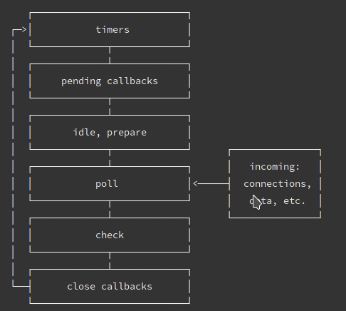
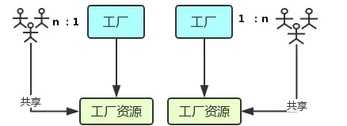
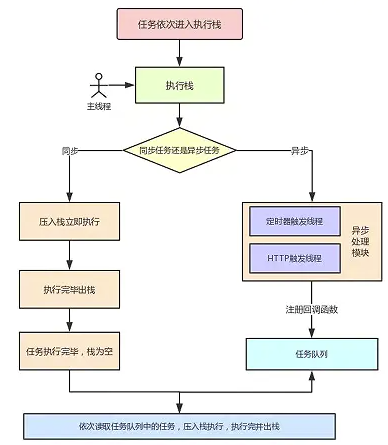
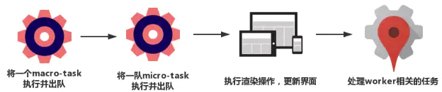
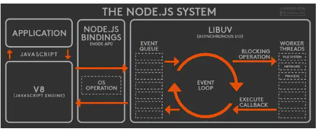
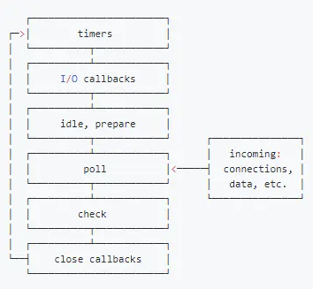
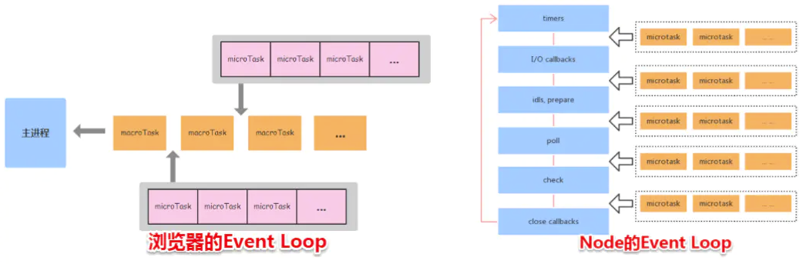
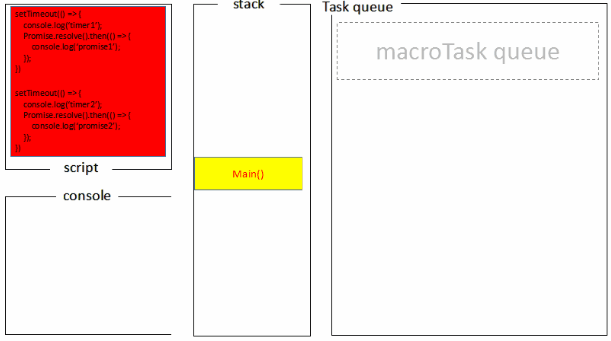
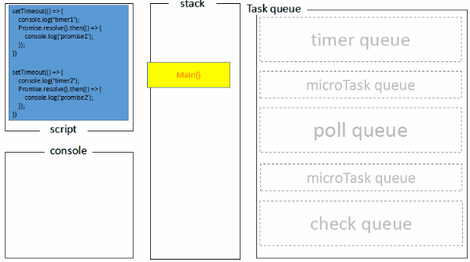

# 前端面试题汇总-浏览器篇-1

## 1. 浏览器渲染机制

- 浏览器采用流式布局模型（`Flow Based Layout`）
- 浏览器会把`HTML`解析成`DOM`，把`CSS`解析成`CSSOM`，`DOM`和`CSSOM`合并就产生了渲染树（`Render Tree`）。
- 有了`RenderTree`，我们就知道了所有节点的样式，然后计算他们在页面上的大小和位置，最后把节点绘制到页面上。
- 由于浏览器使用流式布局，对`Render Tree`的计算通常只需要遍历一次就可以完成，**但`table`及其内部元素除外，他们可能需要多次计算，通常要花3倍于同等元素的时间，这也是为什么要避免使用`table`布局的原因之一**。

## 2. 重绘

由于节点的几何属性发生改变或者由于样式发生改变而不会影响布局的，称为重绘，例如`outline`, `visibility`, `color`、`background-color`等，重绘的代价，因为浏览器必须验证DOM树上其他节点元素的可见性。

## 3. 回流

回流是布局或者几何属性需要改变就称为回流。回流是影响浏览器性能的关键因素，因为其变化涉及到部分页面（或是整个页面）的布局更新。一个元素的回流可能会导致了其所有子元素以及DOM中紧随其后的节点、祖先节点元素的随后的回流。

```js
<body>
<div class="error">
    <h4>我的组件</h4>
    <p><strong>错误：</strong>错误的描述…</p>
    <h5>错误纠正</h5>
    <ol>
        <li>第一步</li>
        <li>第二步</li>
    </ol>
</div>
</body>
```

在上面的HTML片段中，对该段落(``标签)回流将会引发强烈的回流，因为它是一个子节点。这也导致了祖先的回流（`div.error`和`body` – 视浏览器而定）。此外，``和``也会有简单的回流，因为其在DOM中在回流元素之后。**大部分的回流将导致页面的重新渲染。**

**回流必定会发生重绘，重绘不一定会引发回流。**

#### 4. 浏览器优化

现代浏览器大多都是通过队列机制来批量更新布局，浏览器会把修改操作放在队列中，至少一个浏览器刷新（即16.6ms）才会清空队列，但当你**获取布局信息的时候，队列中可能有会影响这些属性或方法返回值的操作，即使没有，浏览器也会强制清空队列，触发回流与重绘来确保返回正确的值**。

主要包括以下属性或方法：

- `offsetTop`、`offsetLeft`、`offsetWidth`、`offsetHeight`
- `scrollTop`、`scrollLeft`、`scrollWidth`、`scrollHeight`
- `clientTop`、`clientLeft`、`clientWidth`、`clientHeight`
- `width`、`height`
- `getComputedStyle()`
- `getBoundingClientRect()`

所以，我们应该避免频繁的使用上述的属性，他们都会强制渲染刷新队列。

#### 5. 减少重绘与回流

1. CSS

   - **使用 `transform` 替代 `top`**

   - **使用 `visibility` 替换 `display: none`** ，因为前者只会引起重绘，后者会引发回流（改变了布局

   - **避免使用`table`布局**，可能很小的一个小改动会造成整个 `table` 的重新布局。

   - **尽可能在`DOM`树的最末端改变`class`**，回流是不可避免的，但可以减少其影响。尽可能在DOM树的最末端改变class，可以限制了回流的范围，使其影响尽可能少的节点。

   - **避免设置多层内联样式**，CSS 选择符**从右往左**匹配查找，避免节点层级过多。

     ```js
     <div>
       <a> <span></span> </a>
     </div>
     <style>
       span {
         color: red;
       }
       div > a > span {
         color: red;
       }
     </style>
     ```

     对于第一种设置样式的方式来说，浏览器只需要找到页面中所有的 `span` 标签然后设置颜色，但是对于第二种设置样式的方式来说，浏览器首先需要找到所有的 `span` 标签，然后找到 `span` 标签上的 `a` 标签，最后再去找到 `div` 标签，然后给符合这种条件的 `span` 标签设置颜色，这样的递归过程就很复杂。所以我们应该尽可能的避免写**过于具体**的 CSS 选择器，然后对于 HTML 来说也尽量少的添加无意义标签，保证**层级扁平**。

   - **将动画效果应用到`position`属性为`absolute`或`fixed`的元素上**，避免影响其他元素的布局，这样只是一个重绘，而不是回流，同时，控制动画速度可以选择 `requestAnimationFrame`，详见[探讨 requestAnimationFrame](https://github.com/LuNaHaiJiao/blog/issues/30)。

   - **避免使用`CSS`表达式**，可能会引发回流。

   - **将频繁重绘或者回流的节点设置为图层**，图层能够阻止该节点的渲染行为影响别的节点，例如`will-change`、`video`、`iframe`等标签，浏览器会自动将该节点变为图层。

   - **CSS3 硬件加速（GPU加速）**，使用css3硬件加速，可以让`transform`、`opacity`、`filters`这些动画不会引起回流重绘 。但是对于动画的其它属性，比如`background-color`这些，还是会引起回流重绘的，不过它还是可以提升这些动画的性能。

2. JavaScript

   - **避免频繁操作样式**，最好一次性重写`style`属性，或者将样式列表定义为`class`并一次性更改`class`属性。
   - **避免频繁操作`DOM`**，创建一个`documentFragment`，在它上面应用所有`DOM操作`，最后再把它添加到文档中。
   - **避免频繁读取会引发回流/重绘的属性**，如果确实需要多次使用，就用一个变量缓存起来。
   - **对具有复杂动画的元素使用绝对定位**，使它脱离文档流，否则会引起父元素及后续元素频繁回流。


   ## 浏览器与Node的事件循环有何区别?

(Event Loop)

### 浏览器

**关于微任务和宏任务在浏览器的执行顺序是这样的：**

- 执行一只task（宏任务）
- 执行完micro-task队列 （微任务）

如此循环往复下去

> 浏览器的task（宏任务）执行顺序在 [html#event-loops](https://html.spec.whatwg.org/multipage/webappapis.html#event-loops) 里面有讲就不翻译了 常见的 task（宏任务） 比如：setTimeout、setInterval、script（整体代码）、 I/O 操作、UI 渲染等。 常见的 micro-task 比如: new Promise().then(回调)、MutationObserver(html5新特性) 等。

### Node

Node的事件循环是libuv实现的，引用一张官网的图：



大体的task（宏任务）执行顺序是这样的：

- timers定时器：本阶段执行已经安排的 setTimeout() 和 setInterval() 的回调函数。
- pending callbacks待定回调：执行延迟到下一个循环迭代的 I/O 回调。
- idle, prepare：仅系统内部使用。
- poll 轮询：检索新的 I/O 事件;执行与 I/O 相关的回调（几乎所有情况下，除了关闭的回调函数，它们由计时器和 setImmediate() 排定的之外），其余情况 node 将在此处阻塞。
- check 检测：setImmediate() 回调函数在这里执行。
- close callbacks 关闭的回调函数：一些准备关闭的回调函数，如：socket.on('close', ...)。

**微任务和宏任务在Node的执行顺序**

Node 10以前：

- 执行完一个阶段的所有任务
- 执行完nextTick队列里面的内容
- 然后执行完微任务队列的内容

Node 11以后： 和浏览器的行为统一了，都是每执行一个宏任务就执行完微任务队列。

### 一、线程与进程

### 1.概念

我们经常说JS 是单线程执行的，指的是一个进程里只有一个主线程，那到底什么是线程？什么是进程？

官方的说法是：**进程是 CPU资源分配的最小单位；线程是 CPU调度的最小单位**。这两句话并不好理解，我们先来看张图：




- 进程好比图中的工厂，有单独的专属自己的工厂资源。
- 线程好比图中的工人，多个工人在一个工厂中协作工作，工厂与工人是 1:n的关系。也就是说**一个进程由一个或多个线程组成，线程是一个进程中代码的不同执行路线**；
- 工厂的空间是工人们共享的，这象征**一个进程的内存空间是共享的，每个线程都可用这些共享内存**。
- 多个工厂之间独立存在。

### 2.多进程与多线程

- 多进程：在同一个时间里，同一个计算机系统中如果允许两个或两个以上的进程处于运行状态。多进程带来的好处是明显的，比如你可以听歌的同时，打开编辑器敲代码，编辑器和听歌软件的进程之间丝毫不会相互干扰。
- 多线程：程序中包含多个执行流，即在一个程序中可以同时运行多个不同的线程来执行不同的任务，也就是说允许单个程序创建多个并行执行的线程来完成各自的任务。

以Chrome浏览器中为例，当你打开一个 Tab 页时，其实就是创建了一个进程，一个进程中可以有多个线程（下文会详细介绍），比如渲染线程、JS 引擎线程、HTTP 请求线程等等。当你发起一个请求时，其实就是创建了一个线程，当请求结束后，该线程可能就会被销毁。

## 二、浏览器内核

简单来说浏览器内核是通过取得页面内容、整理信息（应用CSS）、计算和组合最终输出可视化的图像结果，通常也被称为渲染引擎。

浏览器内核是多线程，在内核控制下各线程相互配合以保持同步，一个浏览器通常由以下常驻线程组成：

- GUI 渲染线程
- JavaScript引擎线程
- 定时触发器线程
- 事件触发线程
- 异步http请求线程

### 1.GUI渲染线程

- 主要负责页面的渲染，解析HTML、CSS，构建DOM树，布局和绘制等。
- 当界面需要重绘或者由于某种操作引发回流时，将执行该线程。
- 该线程与JS引擎线程互斥，当执行JS引擎线程时，GUI渲染会被挂起，当任务队列空闲时，主线程才会去执行GUI渲染。

### 2.JS引擎线程

- 该线程当然是主要负责处理 JavaScript脚本，执行代码。
- 也是主要负责执行准备好待执行的事件，即定时器计数结束，或者异步请求成功并正确返回时，将依次进入任务队列，等待 JS引擎线程的执行。
- 当然，该线程与 GUI渲染线程互斥，当 JS引擎线程执行 JavaScript脚本时间过长，将导致页面渲染的阻塞。

### 3.定时器触发线程

- 负责执行异步定时器一类的函数的线程，如： setTimeout，setInterval。
- 主线程依次执行代码时，遇到定时器，会将定时器交给该线程处理，当计数完毕后，事件触发线程会将计数完毕后的事件加入到任务队列的尾部，等待JS引擎线程执行。

### 4.事件触发线程

- 主要负责将准备好的事件交给 JS引擎线程执行。

比如 setTimeout定时器计数结束， ajax等异步请求成功并触发回调函数，或者用户触发点击事件时，该线程会将整装待发的事件依次加入到任务队列的队尾，等待 JS引擎线程的执行。

### 5.异步http请求线程

- 负责执行异步请求一类的函数的线程，如： Promise，axios，ajax等。
- 主线程依次执行代码时，遇到异步请求，会将函数交给该线程处理，当监听到状态码变更，如果有回调函数，事件触发线程会将回调函数加入到任务队列的尾部，等待JS引擎线程执行。

## 三、浏览器中的 Event Loop

### 1.Micro-Task 与 Macro-Task

浏览器端事件循环中的异步队列有两种：macro（宏任务）队列和 micro（微任务）队列。

- 常见的 macro-task 比如：setTimeout、setInterval、script（整体代码）、 I/O 操作、UI 渲染等。
- 常见的 micro-task 比如: new Promise().then(回调)、MutationObserver(html5新特性) 等。

### 2.Event Loop 过程解析

一个完整的 Event Loop 过程，可以概括为以下阶段：





- 一开始执行栈空,我们可以把**执行栈认为是一个存储函数调用的栈结构，遵循先进后出的原则**。micro 队列空，macro 队列里有且只有一个 script 脚本（整体代码）。
- 全局上下文（script 标签）被推入执行栈，同步代码执行。在执行的过程中，会判断是同步任务还是异步任务，通过对一些接口的调用，可以产生新的 macro-task 与 micro-task，它们会分别被推入各自的任务队列里。同步代码执行完了，script 脚本会被移出 macro 队列，这个过程本质上是队列的 macro-task 的执行和出队的过程。
- 上一步我们出队的是一个 macro-task，这一步我们处理的是 micro-task。但需要注意的是：当 macro-task 出队时，任务是**一个一个**执行的；而 micro-task 出队时，任务是**一队一队**执行的。因此，我们处理 micro 队列这一步，会逐个执行队列中的任务并把它出队，直到队列被清空。
- **执行渲染操作，更新界面**
- 检查是否存在 Web worker 任务，如果有，则对其进行处理
- 上述过程循环往复，直到两个队列都清空

我们总结一下，每一次循环都是一个这样的过程：





**当某个宏任务执行完后,会查看是否有微任务队列。如果有，先执行微任务队列中的所有任务，如果没有，会读取宏任务队列中排在最前的任务，执行宏任务的过程中，遇到微任务，依次加入微任务队列。栈空后，再次读取微任务队列里的任务，依次类推。**

接下来我们看道例子来介绍上面流程：

```js
Promise.resolve().then(()=>{
  console.log('Promise1')  
  setTimeout(()=>{
    console.log('setTimeout2')
  },0)
})
setTimeout(()=>{
  console.log('setTimeout1')
  Promise.resolve().then(()=>{
    console.log('Promise2')    
  })
},0)
```

最后输出结果是Promise1，setTimeout1，Promise2，setTimeout2

- 一开始执行栈的同步任务（这属于宏任务）执行完毕，会去查看是否有微任务队列，上题中存在(有且只有一个)，然后执行微任务队列中的所有任务输出Promise1，同时会生成一个宏任务 setTimeout2
- 然后去查看宏任务队列，宏任务 setTimeout1 在 setTimeout2 之前，先执行宏任务 setTimeout1，输出 setTimeout1
- 在执行宏任务setTimeout1时会生成微任务Promise2 ，放入微任务队列中，接着先去清空微任务队列中的所有任务，输出 Promise2
- 清空完微任务队列中的所有任务后，就又会去宏任务队列取一个，这回执行的是 setTimeout2

## 四、Node 中的 Event Loop

### 1.Node简介

Node 中的 Event Loop 和浏览器中的是完全不相同的东西。Node.js采用V8作为js的解析引擎，而I/O处理方面使用了自己设计的libuv，libuv是一个基于事件驱动的跨平台抽象层，封装了不同操作系统一些底层特性，对外提供统一的API，事件循环机制也是它里面的实现（下文会详细介绍）。




Node.js的运行机制如下:


- V8引擎解析JavaScript脚本。
- 解析后的代码，调用Node API。
- libuv库负责Node API的执行。它将不同的任务分配给不同的线程，形成一个Event Loop（事件循环），以异步的方式将任务的执行结果返回给V8引擎。
- V8引擎再将结果返回给用户。

### 2.六个阶段

其中libuv引擎中的事件循环分为 6 个阶段，它们会按照顺序反复运行。每当进入某一个阶段的时候，都会从对应的回调队列中取出函数去执行。当队列为空或者执行的回调函数数量到达系统设定的阈值，就会进入下一阶段。





从上图中，大致看出node中的事件循环的顺序：

外部输入数据-->轮询阶段(poll)-->检查阶段(check)-->关闭事件回调阶段(close callback)-->定时器检测阶段(timer)-->I/O事件回调阶段(I/O callbacks)-->闲置阶段(idle, prepare)-->轮询阶段（按照该顺序反复运行）...

- timers 阶段：这个阶段执行timer（setTimeout、setInterval）的回调
- I/O callbacks 阶段：处理一些上一轮循环中的少数未执行的 I/O 回调
- idle, prepare 阶段：仅node内部使用
- poll 阶段：获取新的I/O事件, 适当的条件下node将阻塞在这里
- check 阶段：执行 setImmediate() 的回调
- close callbacks 阶段：执行 socket 的 close 事件回调

注意：**上面六个阶段都不包括 process.nextTick()**(下文会介绍)

接下去我们详细介绍`timers`、`poll`、`check`这3个阶段，因为日常开发中的绝大部分异步任务都是在这3个阶段处理的。

#### (1) timer

timers 阶段会执行 setTimeout 和 setInterval 回调，并且是由 poll 阶段控制的。 同样，**在 Node 中定时器指定的时间也不是准确时间，只能是尽快执行**。

#### (2) poll

poll 是一个至关重要的阶段，这一阶段中，系统会做两件事情

1.回到 timer 阶段执行回调

2.执行 I/O 回调

并且在进入该阶段时如果没有设定了 timer 的话，会发生以下两件事情

- 如果 poll 队列不为空，会遍历回调队列并同步执行，直到队列为空或者达到系统限制
- 如果 poll 队列为空时，会有两件事发生
  - 如果有 setImmediate 回调需要执行，poll 阶段会停止并且进入到 check 阶段执行回调
  - 如果没有 setImmediate 回调需要执行，会等待回调被加入到队列中并立即执行回调，这里同样会有个超时时间设置防止一直等待下去

当然设定了 timer 的话且 poll 队列为空，则会判断是否有 timer 超时，如果有的话会回到 timer 阶段执行回调。

#### (3) check阶段

setImmediate()的回调会被加入check队列中，从event loop的阶段图可以知道，check阶段的执行顺序在poll阶段之后。 我们先来看个例子:

```js
console.log('start')
setTimeout(() => {
  console.log('timer1')
  Promise.resolve().then(function() {
    console.log('promise1')
  })
}, 0)
setTimeout(() => {
  console.log('timer2')
  Promise.resolve().then(function() {
    console.log('promise2')
  })
}, 0)
Promise.resolve().then(function() {
  console.log('promise3')
})
console.log('end')
//start=>end=>promise3=>timer1=>timer2=>promise1=>promise2

```

- 一开始执行栈的同步任务（这属于宏任务）执行完毕后（依次打印出start end，并将2个timer依次放入timer队列）,会先去执行微任务（**这点跟浏览器端的一样**），所以打印出promise3
- 然后进入timers阶段，执行timer1的回调函数，打印timer1，并将promise.then回调放入microtask队列，同样的步骤执行timer2，打印timer2；这点跟浏览器端相差比较大，**timers阶段有几个setTimeout/setInterval都会依次执行**，并不像浏览器端，每执行一个宏任务后就去执行一个微任务（关于Node与浏览器的 Event Loop 差异，下文还会详细介绍）。

### 3.Micro-Task 与 Macro-Task

Node端事件循环中的异步队列也是这两种：macro（宏任务）队列和 micro（微任务）队列。

- 常见的 macro-task 比如：setTimeout、setInterval、 setImmediate、script（整体代码）、 I/O 操作等。
- 常见的 micro-task 比如: process.nextTick、new Promise().then(回调)等。

### 4.注意点

#### (1) setTimeout 和 setImmediate

二者非常相似，区别主要在于调用时机不同。

- setImmediate 设计在poll阶段完成时执行，即check阶段；
- setTimeout 设计在poll阶段为空闲时，且设定时间到达后执行，但它在timer阶段执行

```js
setTimeout(function timeout () {
  console.log('timeout');
},0);
setImmediate(function immediate () {
  console.log('immediate');
});
```

- 对于以上代码来说，setTimeout 可能执行在前，也可能执行在后。
- 首先 setTimeout(fn, 0) === setTimeout(fn, 1)，这是由源码决定的 进入事件循环也是需要成本的，如果在准备时候花费了大于 1ms 的时间，那么在 timer 阶段就会直接执行 setTimeout 回调
- 如果准备时间花费小于 1ms，那么就是 setImmediate 回调先执行了

但当二者在异步i/o callback内部调用时，总是先执行setImmediate，再执行setTimeout

```js
const fs = require('fs')
fs.readFile(__filename, () => {
    setTimeout(() => {
        console.log('timeout');
    }, 0)
    setImmediate(() => {
        console.log('immediate')
    })
})
// immediate
// timeout
```

在上述代码中，setImmediate 永远先执行。因为两个代码写在 IO 回调中，IO 回调是在 poll 阶段执行，当回调执行完毕后队列为空，发现存在 setImmediate 回调，所以就直接跳转到 check 阶段去执行回调了。

#### (2) process.nextTick

这个函数其实是独立于 Event Loop 之外的，它有一个自己的队列，当每个阶段完成后，如果存在 nextTick 队列，就会清空队列中的所有回调函数，并且优先于其他 microtask 执行。

```js
setTimeout(() => {
 console.log('timer1')
 Promise.resolve().then(function() {
   console.log('promise1')
 })
}, 0)
process.nextTick(() => {
 console.log('nextTick')
 process.nextTick(() => {
   console.log('nextTick')
   process.nextTick(() => {
     console.log('nextTick')
     process.nextTick(() => {
       console.log('nextTick')
     })
   })
 })
})
// nextTick=>nextTick=>nextTick=>nextTick=>timer1=>promise1
```

## 五、Node与浏览器的 Event Loop 差异

**浏览器环境下，microtask的任务队列是每个macrotask执行完之后执行。而在Node.js中，microtask会在事件循环的各个阶段之间执行，也就是一个阶段执行完毕，就会去执行microtask队列的任务**。




接下我们通过一个例子来说明两者区别：

```js
setTimeout(()=>{
    console.log('timer1')
    Promise.resolve().then(function() {
        console.log('promise1')
    })
}, 0)
setTimeout(()=>{
    console.log('timer2')
    Promise.resolve().then(function() {
        console.log('promise2')
    })
}, 0)

```

浏览器端运行结果：`timer1=>promise1=>timer2=>promise2`

浏览器端的处理过程如下：





Node端运行结果分两种情况：

- 如果是node11版本一旦执行一个阶段里的一个宏任务(setTimeout,setInterval和setImmediate)就立刻执行微任务队列，这就跟浏览器端运行一致，最后的结果为`timer1=>promise1=>timer2=>promise2`
- 如果是node10及其之前版本：要看第一个定时器执行完，第二个定时器是否在完成队列中。
  - 如果是第二个定时器还未在完成队列中，最后的结果为`timer1=>promise1=>timer2=>promise2`
  - 如果是第二个定时器已经在完成队列中，则最后的结果为`timer1=>timer2=>promise1=>promise2`(下文过程解释基于这种情况下)

1.全局脚本（main()）执行，将2个timer依次放入timer队列，main()执行完毕，调用栈空闲，任务队列开始执行；

2.首先进入timers阶段，执行timer1的回调函数，打印timer1，并将promise1.then回调放入microtask队列，同样的步骤执行timer2，打印timer2；

3.至此，timer阶段执行结束，event loop进入下一个阶段之前，执行microtask队列的所有任务，依次打印promise1、promise2

Node端的处理过程如下：




## 六、总结

浏览器和Node 环境下，microtask 任务队列的执行时机不同

- Node端，microtask 在事件循环的各个阶段之间执行
- 浏览器端，microtask 在事件循环的 macrotask 执行完之后执行