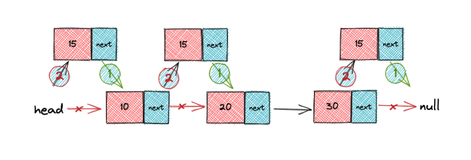

# 常用 Markdown 演示


## 图片演示


## 引用演示

> 我去菜市场的时候没有赶上趟，却碰上了她正落魄的时光，不知道她吻遍了多少橱窗才习惯了她的理想就在一步之隔的桌上，我给了她两根火腿肠，看清了她的模样，满身的泥泞和风霜都没抖落她眼里的光和对爱的向往，她啊，在人来人往的地方流浪，可能从来不知道爱是可以被人捧在手掌，所以她这一生都在路上


## 表情使用
🌰 🙂 👆🏻

## 标记文本重点

可能从来不知道==爱是可以被人捧在手掌==，所以她这一生都在路上

## 分割线

---


## 容器演示

::: tip 标题

这是是你

```js
const bar = "bar";
```

:::

::: warning 标题

这是是你

```js
const bar = "bar";
```

:::

::: danger 标题

这是是你

```js
const bar = "bar";
```

:::

## 《滕王阁序 》文章演示

【作者】王勃 （650 年 — 676 年） 【朝代】唐

豫章故郡，洪都新府。星分翼轸，地接衡庐。襟三江而带五湖，控蛮荆而引瓯越。物华天宝，龙光射牛斗之墟；人杰地灵，徐孺下陈蕃之榻。雄州雾列，俊采星驰。台隍枕夷夏之交，宾主尽东南之美。都督阎公之雅望，棨戟遥临；宇文新州之懿范，襜帷暂驻。十旬休假，胜友如云；千里逢迎，高朋满座。腾蛟起凤，孟学士之词宗；紫电青霜，王将军之武库。家君作宰，路出名区；童子何知，躬逢胜饯。

时维九月，序属三秋。潦水尽而寒潭清，烟光凝而暮山紫。俨骖騑于上路，访风景于崇阿；临帝子之长洲，得天人之旧馆。层峦耸翠，上出重霄；飞阁流丹，下临无地。鹤汀凫渚，穷岛屿之萦回；桂殿兰宫，即冈峦之体势。

披绣闼，俯雕甍，山原旷其盈视，川泽纡其骇瞩。闾阎扑地，钟鸣鼎食之家；舸舰弥津，青雀黄龙之舳。云销雨霁，彩彻区明。落霞与孤鹜齐飞，秋水共长天一色。渔舟唱晚，响穷彭蠡之滨；雁阵惊寒，声断衡阳之浦。

遥襟甫畅，逸兴遄飞。爽籁发而清风生，纤歌凝而白云遏。睢园绿竹，气凌彭泽之樽；邺水朱华，光照临川之笔。四美具，二难并。穷睇眄于中天，极娱游于暇日。天高地迥，觉宇宙之无穷；兴尽悲来，识盈虚之有数。望长安于日下，目吴会于云间。地势极而南溟深，天柱高而北辰远。关山难越，谁悲失路之人？萍水相逢，尽是他乡之客。怀帝阍而不见，奉宣室以何年？

嗟乎！时运不齐，命途多舛。冯唐易老，李广难封。屈贾谊于长沙，非无圣主；窜梁鸿于海曲，岂乏明时？所赖君子见机，达人知命。老当益壮，宁移白首之心？穷且益坚，不坠青云之志。酌贪泉而觉爽，处涸辙以犹欢。北海虽赊，扶摇可接；东隅已逝，桑榆非晚。孟尝高洁，空余报国之情；阮籍猖狂，岂效穷途之哭！

勃，三尺微命，一介书生。无路请缨，等终军之弱冠；有怀投笔，慕宗悫之长风。舍簪笏于百龄，奉晨昏于万里。非谢家之宝树，接孟氏之芳邻。他日趋庭，叨陪鲤对；今兹捧袂，喜托龙门。杨意不逢，抚凌云而自惜；钟期既遇，奏流水以何惭？

呜乎！胜地不常，盛筵难再；兰亭已矣，梓泽丘墟。临别赠言，幸承恩于伟饯；登高作赋，是所望于群公。敢竭鄙怀，恭疏短引；一言均赋，四韵俱成。请洒潘江，各倾陆海云尔：

滕王高阁临江渚，佩玉鸣鸾罢歌舞。

画栋朝飞南浦云，珠帘暮卷西山雨。

闲云潭影日悠悠，物换星移几度秋。

阁中帝子今何在？槛外长江空自流。

## 英文演示

Youth is not a time of life; it is a state of mind. It is not a matter of rosy cheeks, red lips and supple knees. It is a matter of the will, a quality of the imagination, vigor of the emotions; it is the freshness of the deep spring of life.

Youth means a temperamental predominance of courage over timidity, of the appetite for adventure over the love of ease. This often exits in a man of 60, more than a boy of 20.nobody grows merely by the number of years; we grow old by deserting our ideas. Years may wrinkle the skin, but to give up enthusiasm wrinkles the soul. Worry, fear, self-distrust1 bows the heart and turns the spirit back to dust.

Whether 60 or 16, there is in every human being’s heart the lure of wonders, the unfailing childlike appetite of what’s next and the joy of the game of living. In the center of your heart and my heart there is a wireless station; so long as it receives messages of beauty, hope, cheer, courage and power from men and from infinite, so long as you are young.

When the aerials are down, and your spirit is covered with the snows of cynicism and the ice of pessimism, then you’ve grown old, even at 20, but as long as your aerials are up, to catch waves of optimism, there’s hope you may die young at 80.


## 链接演示

[Markdown 语法介绍](https://docs.github.com/en/github/writing-on-github/getting-started-with-writing-and-formatting-on-github/basic-writing-and-formatting-syntax)

### 图片链接

图片还可以和链接嵌套使用，能够实现推荐卡片的效果，用法如下：

[](https://artiely.gitee.io)

## 文字修饰

~~这是要被删除的内容。~~

**加粗** *斜体*  *HelloWorld*


## 代码

```java
// FileName: HelloWorld.java
public class HelloWorld {
  // Java 入口程序，程序从此入口
  public static void main(String[] args) {
    System.out.println("Hello,World!"); // 向控制台打印一条语句
  }
}
```

### 单行

`javascript`

### diff 效果

```diff
+ 新增项
- 删除项
```

## 自定义容器


::: details
这是一个 details 标签
:::


- 示例 2 （自定义标题）：

::: danger STOP
危险区域，禁止通行
:::


::: details 点击查看代码

```js
console.log("你好，VuePress！");
```

:::

### 代码组


:::: code-group
::: code-group-item FOO

```js
const foo = "foo";
```

:::
::: code-group-item BAR

```js
const bar = "bar";
```

:::
::::

## 有序无序
- 早安 被生物钟叫醒的苦命打工人。
- 早上好 在天愿作比翼鸟 在地怨为打工人。
- 这么不努力，怎么做打工人啊你！
- 我要悄悄打工，然后惊艳所有人！
- [ ] 别人的朋友圈都是帅哥美女 我的朋友圈全是打工人。
- [x] 敢上九天揽月 敢下五洋捉鳖 但却不敢迟到 因为迟到扣钱 早安打工人。

1. 早安 被生物钟叫醒的苦命打工人。
1. 早上好 在天愿作比翼鸟 在地怨为打工人。
1. 这么不努力，怎么做打工人啊你！
1. 我要悄悄打工，然后惊艳所有人！
1. [ ] 别人的朋友圈都是帅哥美女 我的朋友圈全是打工人。
1. [x] 敢上九天揽月 敢下五洋捉鳖 但却不敢迟到 因为迟到扣钱 早安打工人。

## 表格演示

| 序号 | 表述                                                                     | 作者 | 时期 | 年代            | 鉴赏                           |
| ---- | ------------------------------------------------------------------------ | ---- | ---- | --------------- | ------------------------------ |
| 01   | 豫章故郡，洪都新府。星分翼轸，地接衡庐。襟三江而带五湖，控蛮荆而引瓯越。 | 王勃 | 唐   | 650 年 — 676 年 | 落霞与孤鹜齐飞，秋水共长天一色 |
| 01   | 豫章故郡，洪都新府。星分翼轸，地接衡庐。襟三江而带五湖，控蛮荆而引瓯越。 | 王勃 | 唐   | 650 年 — 676 年 | 落霞与孤鹜齐飞，秋水共长天一色 |


## iframe演示

<!-- <iframe id="embed_dom" name="embed_dom" frameborder="0" style="display:block;width:100%; height:245px;" src="https://www.processon.com/embed/5788b02fe4b066b917ace5cc"></iframe> -->

<DIframe src="https://www.processon.com/embed/5788b02fe4b066b917ace5cc" />